## Slack Bot

**Author:** Langgenius  
**Version:** 0.0.1
**Type:** extension

### Description

Follow these steps to integrate the Slack plugin:

1. **Create a Slack App**

   - Either create an app from a manifest or from scratch
   - Name your app and select your target workspace
     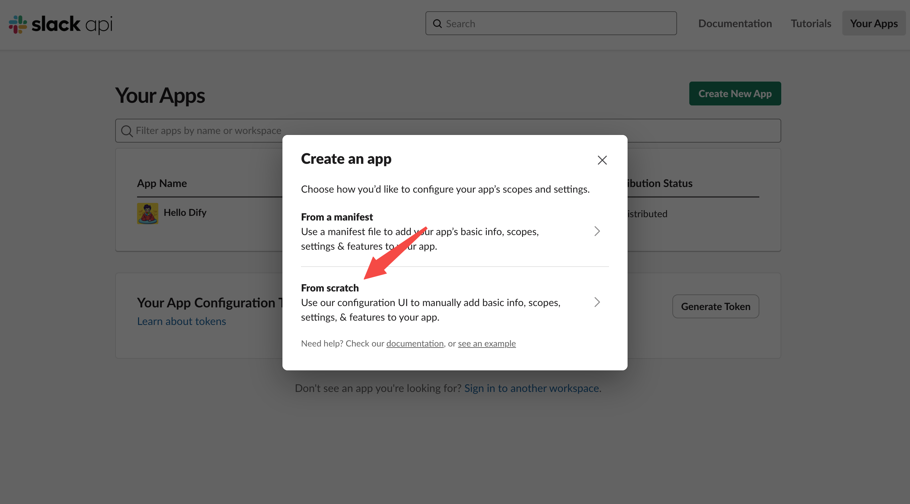
     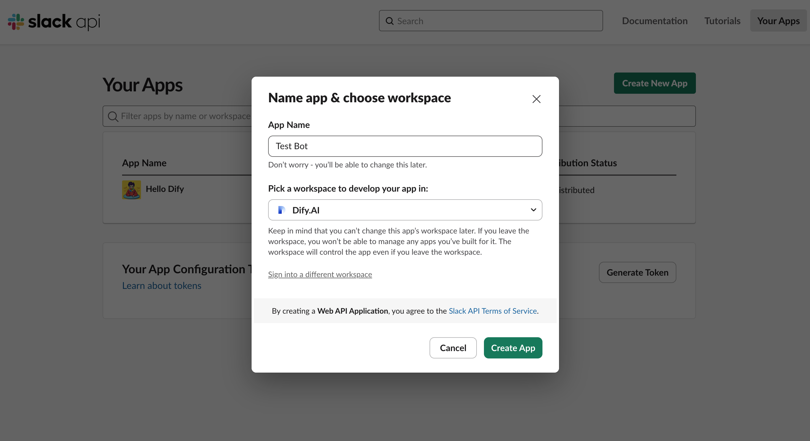

2. **Configure App Settings**

   - Enable Incoming Webhooks
   - Install the app to your workspace
   - Choose a channel for message delivery
   - Locate your "Bot User OAuth Token" in settings
     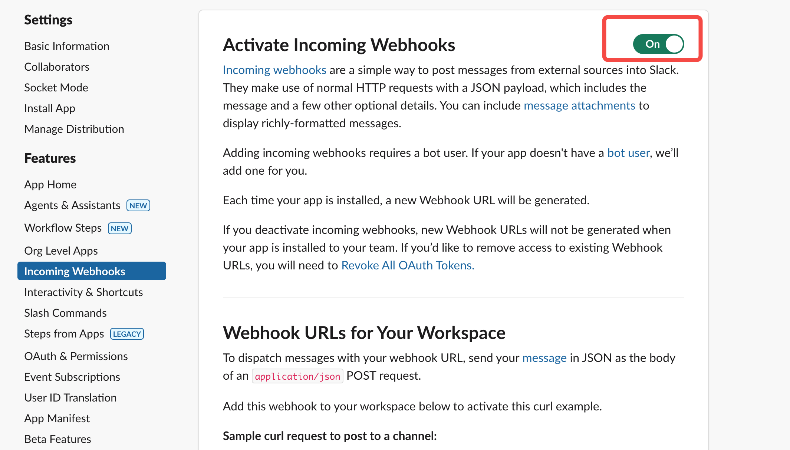
     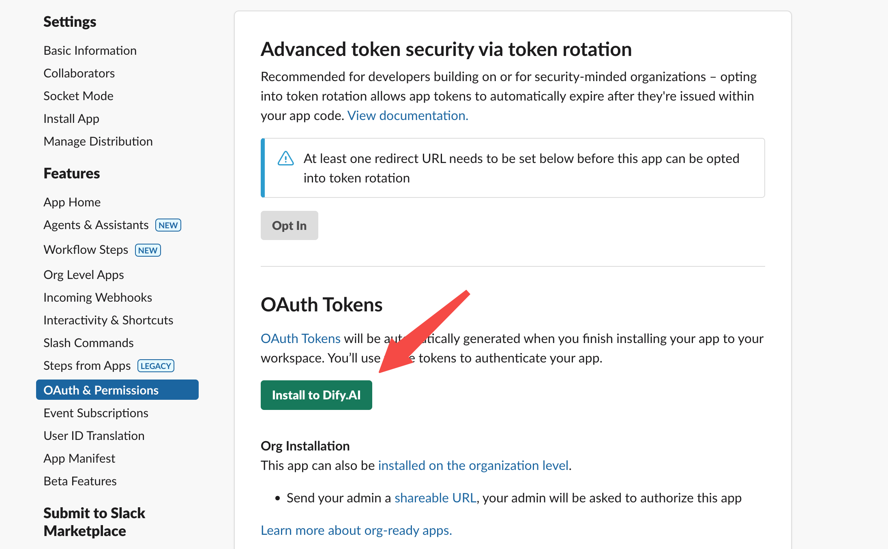
     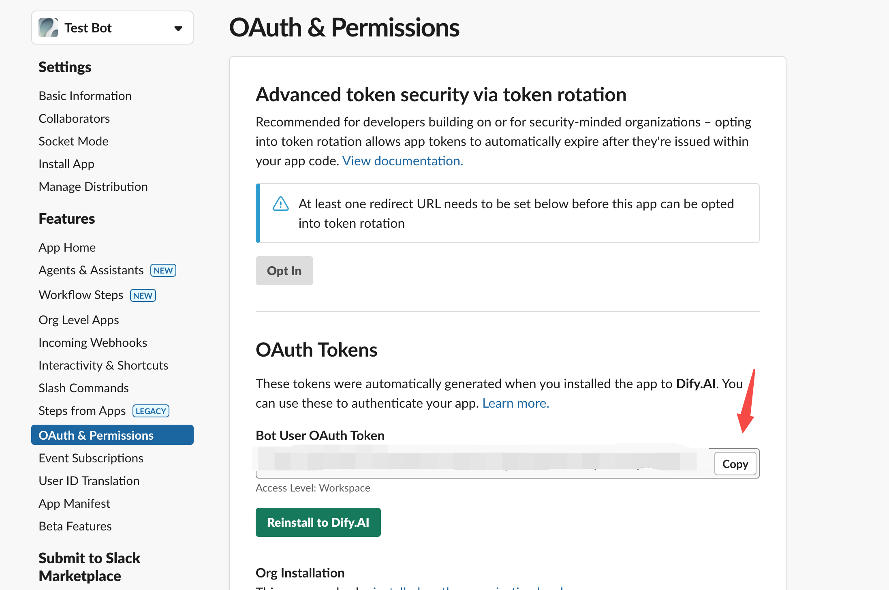

3. **Set Up Dify Endpoint**

   - Create a new endpoint with a custom name
   - Input your Bot User OAuth Token
   - Set "Allow Retry" to false (recommended to prevent duplicate messages)
   - Link to your Dify chatflow/chatbot/agent
   - Save and copy the generated endpoint URL

    

      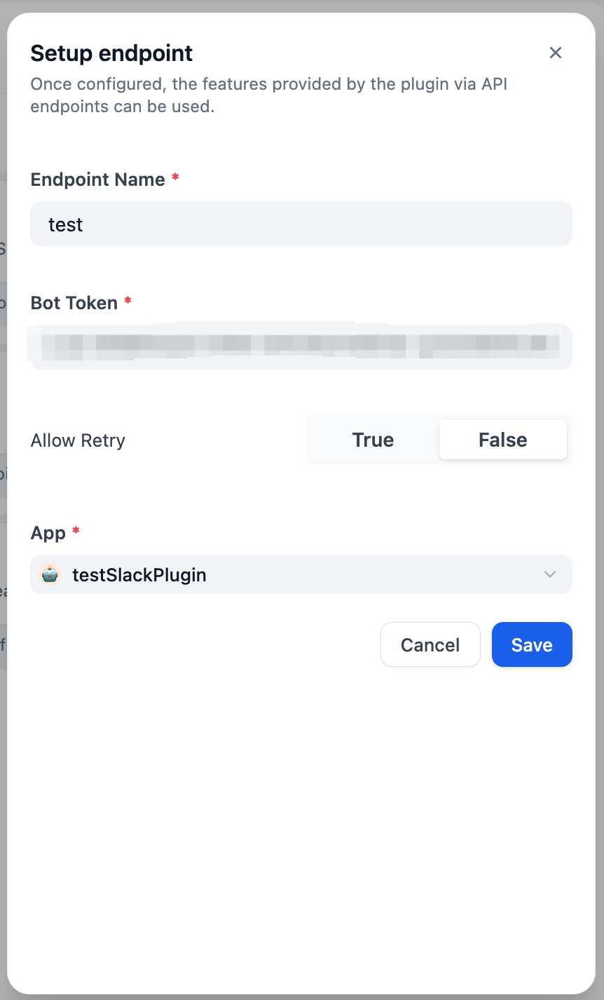
      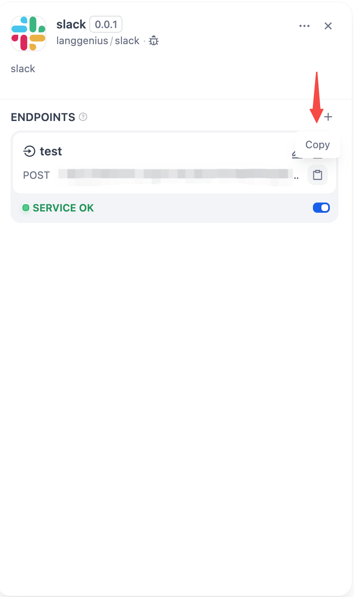
    

4. **Complete Slack App Configuration**

   - Enable Event Subscriptions
   - Paste the Dify endpoint URL as the Request URL
   - Add required OAuth scopes for Event Subscriptions
   - Configure App's OAuth & Permissions with necessary scopes
     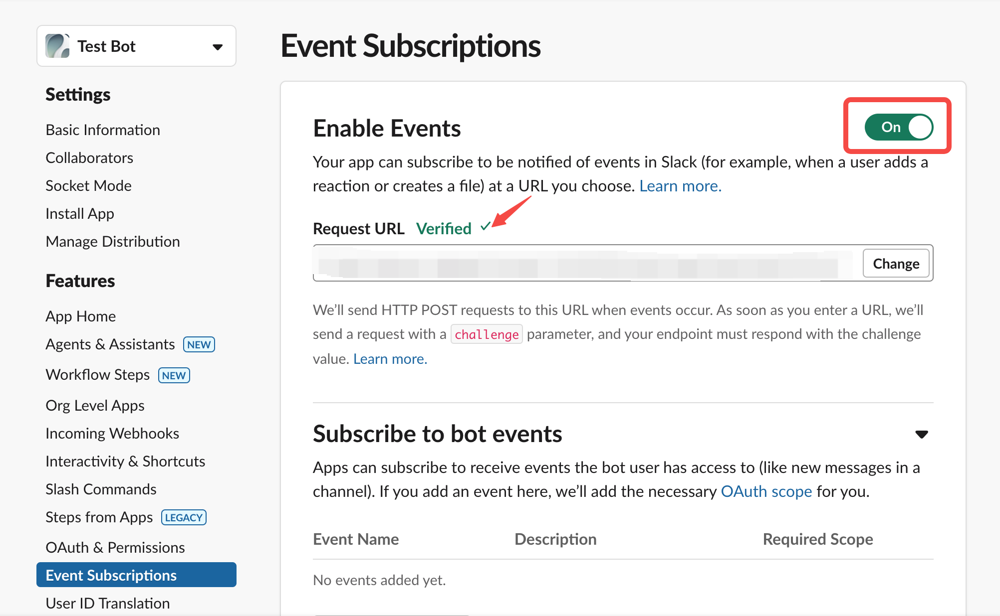
     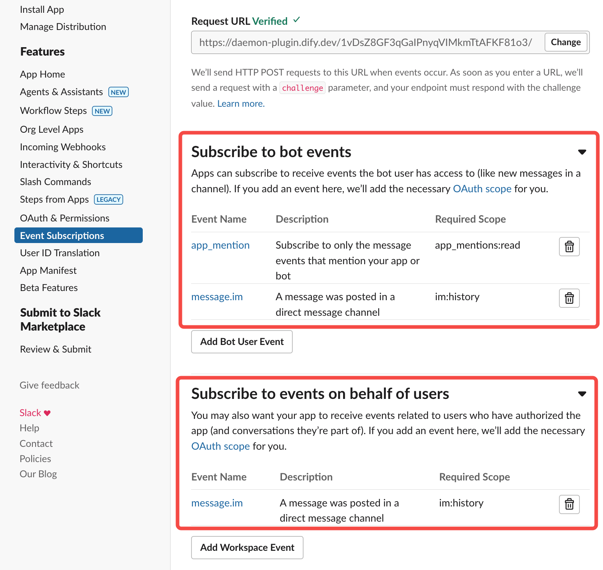

     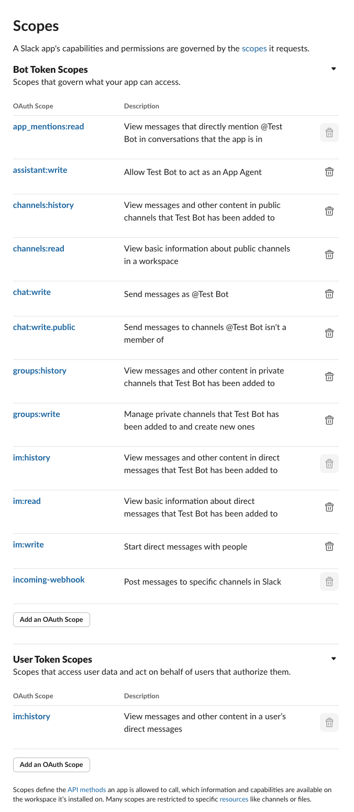

5. **Final Steps**
   - Reinstall the app to your workspace if you made changes
   - Add the bot to your chosen channel
   - Start interacting by @mentioning the bot in messages
     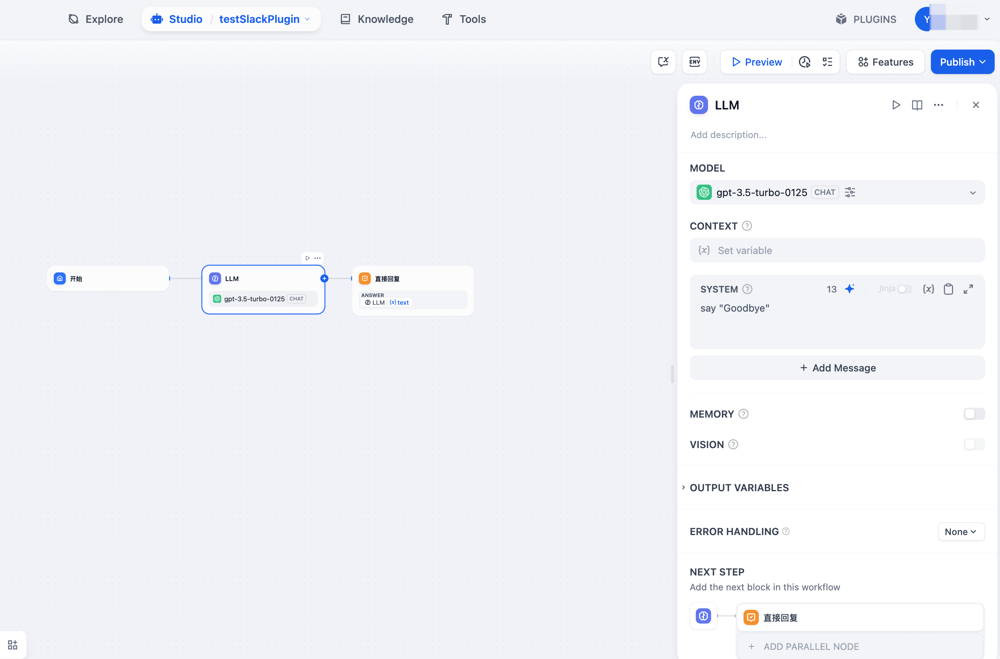
     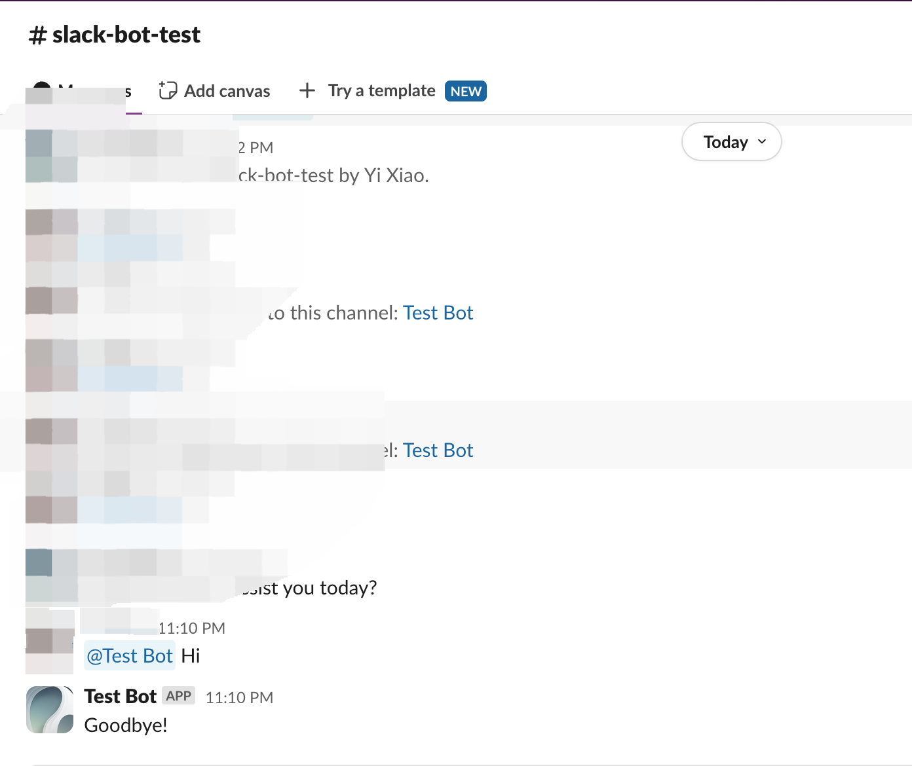
