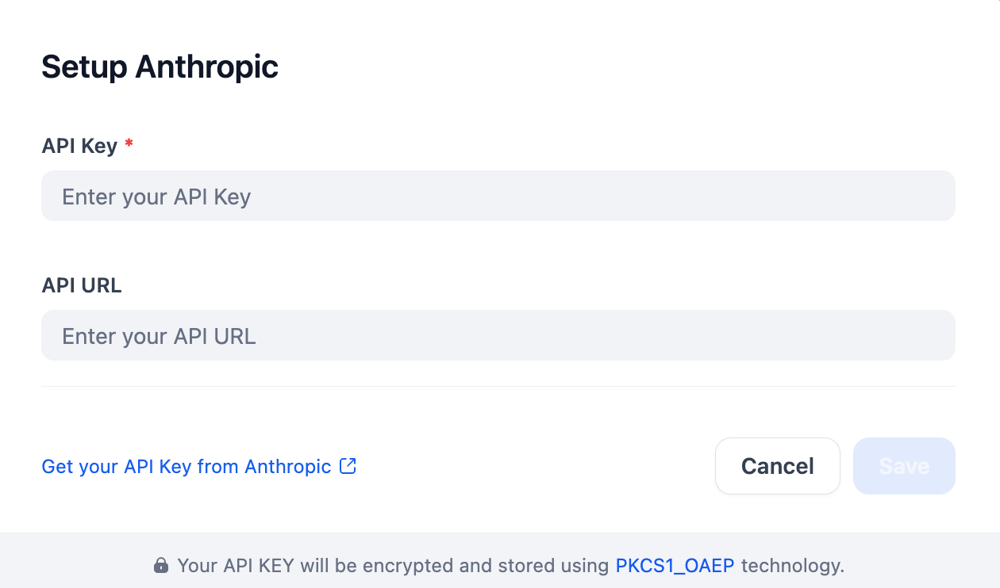

## Overview
Anthropic offers a suite of AI models designed for safety and helpfulness, excelling in natural language processing and generation tasks such as coding and creative writing. Using this plugin, developers can easily configure and access LLMs from the Claude family (Sonnet, Haiku, and Opus) by providing the necessary API credentials.

## Configure
You'll need your Anthropic API Key to configure this plugin. After obtaining it from Anthropic, enter it along with your API URL in the settings below. Save to activate.

