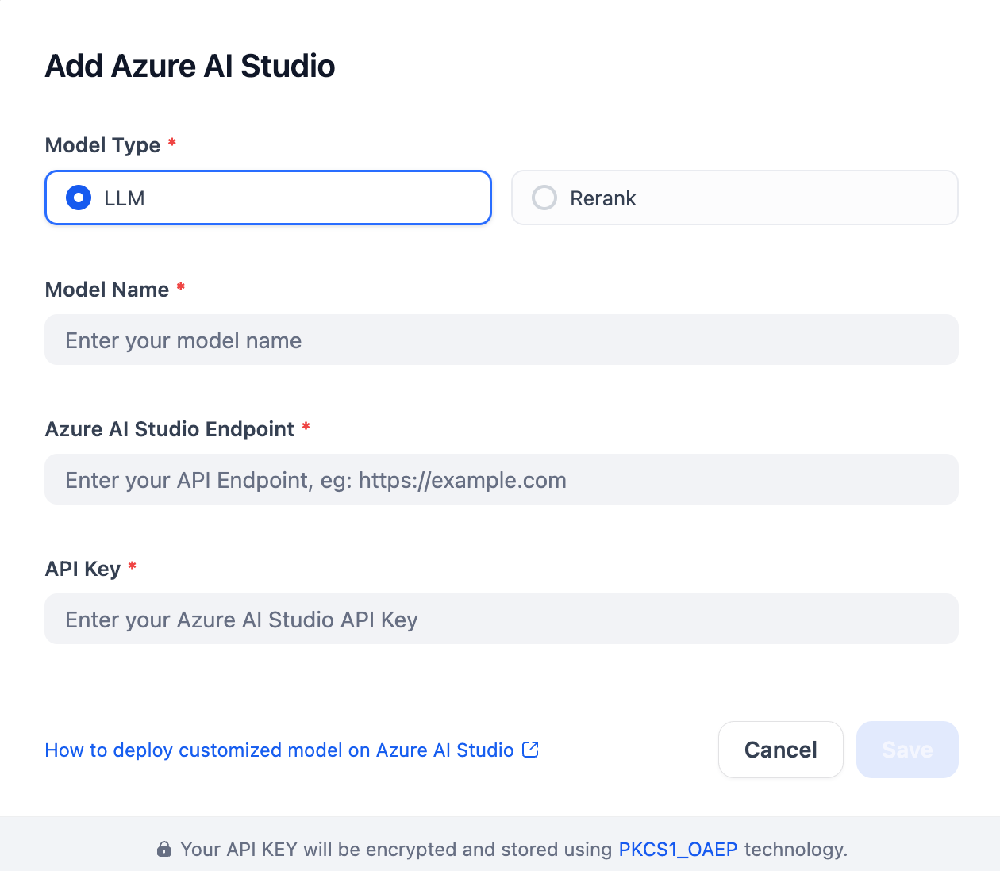

## Overview

Azure AI Foundry serves as a model provider for a variety of AI applications. Users can add rich models into this plugin, including LLMs and rerank models from several providers like Azure OpenAI, Meta (Llama), Cohere, and Mistral. Simply configure the parameters and you're good to go.

## Configure
With the plugin installed, configure Azure AI Studio by providing the Model Type, Model Name, Azure AI Studio Endpoint, and API Key. Save in Model Provider.

