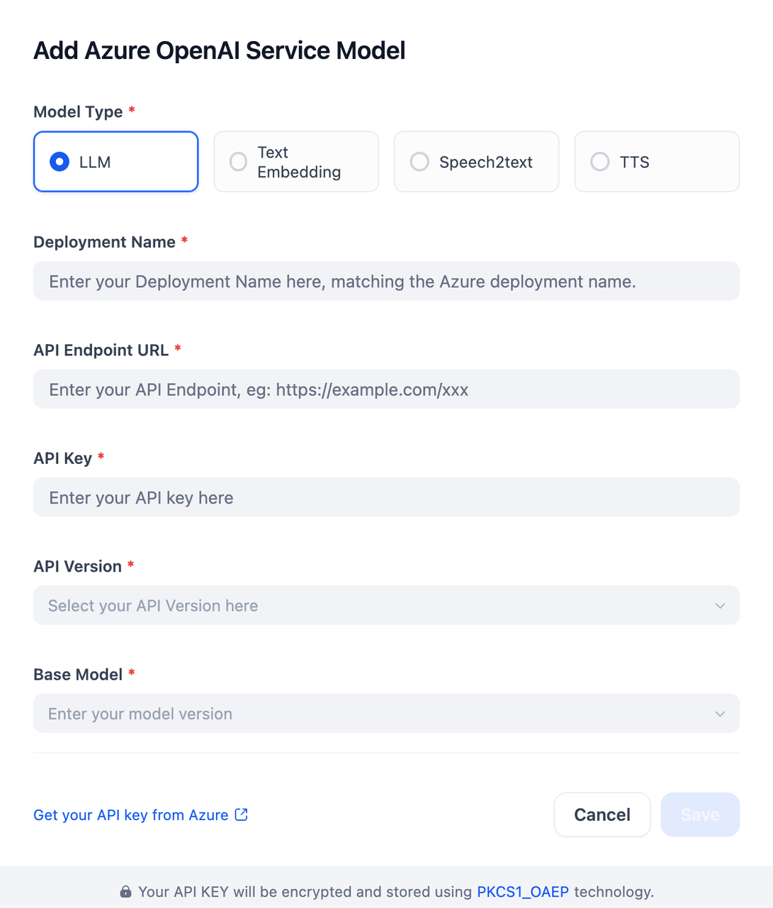

## Overview
Azure OpenAI Service is a cloud-based platform that provides access to advanced AI models developed by OpenAI, integrated with Microsoft's Azure infrastructure. This plugin allows users to leverage cutting-edge generative AI capabilities such as LLMs, text embedding, speech-to-text (STT), and text-to-speech (TTS) for various applications, ensuring security and compliance through Azure's robust framework.

## Configure
Once the plugin is installed, configure your Azure OpenAI Service Model by providing the Model Type, Deployment Name, API Endpoint URL, your API Key, the API Version, and the Base Model. Find your API key on Azure. Save to complete the setup.

