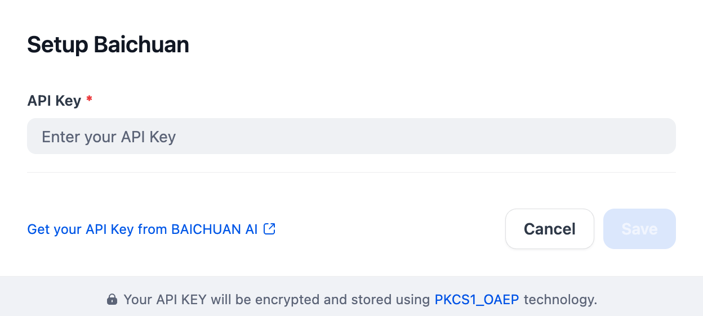

## Overview

Baichun is an open-source, large-scale pre-trained language model which supports both Chinese and English languages with the benchmarks such as C-Eval, MMLU, etc. With those models, Baichuan provides a rich set of AI tools, including language models, chat models, and embedding models.

## Configure

After installing the plugin, configure the API key and API base within the Model Provider settings. Obtain your API key from [here](https://www.baichuan-ai.com/home). Once saved, you can begin using Baichuan to build your AI agents and agentic workflows.

