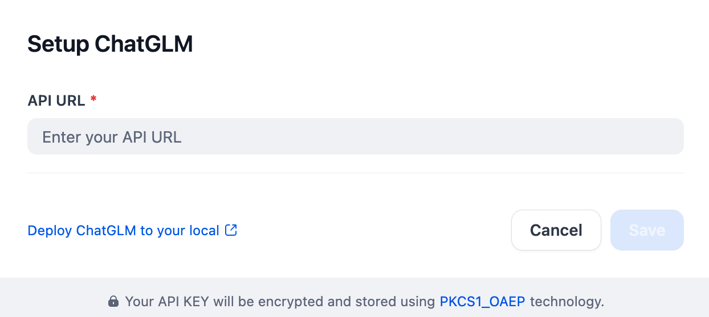

## Overview

[ChatGLM](https://open.bigmodel.cn/) is an open language model based on GLM (General Language Model) framework that supports English and Chinese. It's designed for tasks like text generation, conversation, and information extraction, and can be fine-tuned for specific applications.

## Configure

After installing the plugin, configure the API URL and API base within the Model Provider settings. Obtain your API URL from [here](https://open.bigmodel.cn/). Once saved, you can begin using ChatGLM to build your AI agents and agentic workflows.
