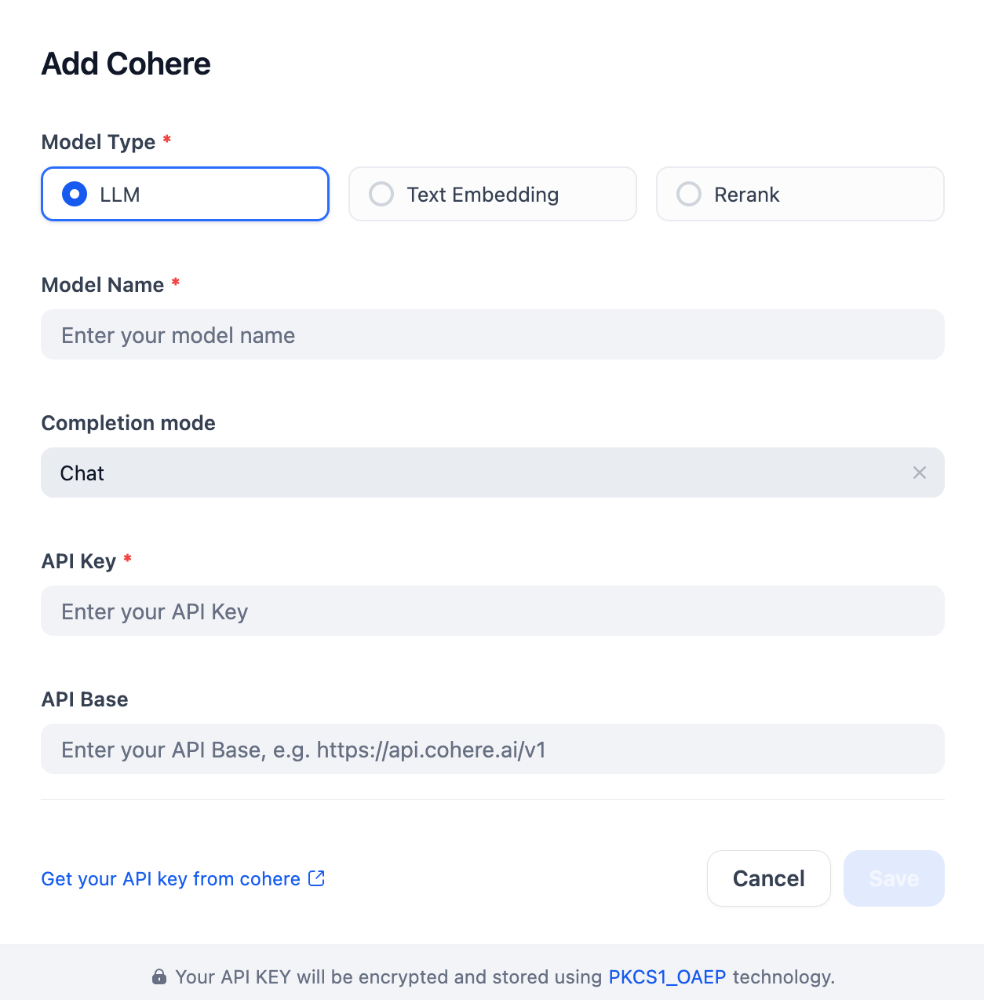

## Overview
Cohere provides a robust suite of AI models—including LLMs, text embedding, and reranking—designed for enterprise applications. To begin building, simply configure the parameters and add models to this plugin.

## Configure
Install the Cohere plugin, then configure it in Model Provider settings with the Model Type, Name, Completion mode, API Key, and API Base. Get your API key from [Cohere](https://dashboard.cohere.com/api-keys) and save your settings.

