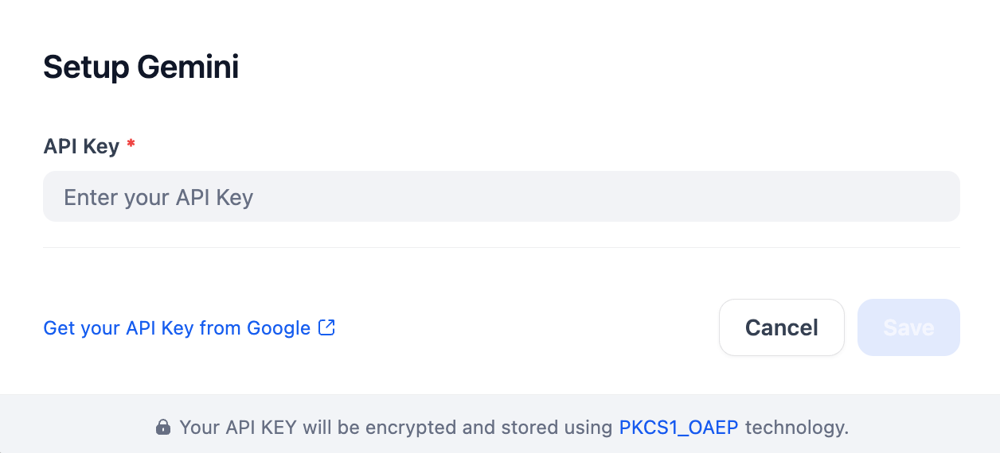

## Overview
Gemini is a family of multimodal AI models from Google, designed to process and generate various types of data, including text, images, audio, and video. This plugin provides access to Gemini models via a single API key, enabling developers to build versatile multimodal AI applications.

## Configure
After installing the Gemini plugin, configure it with your API key, which you can get from Google. Enter the key in the Model Provider settings and save.

