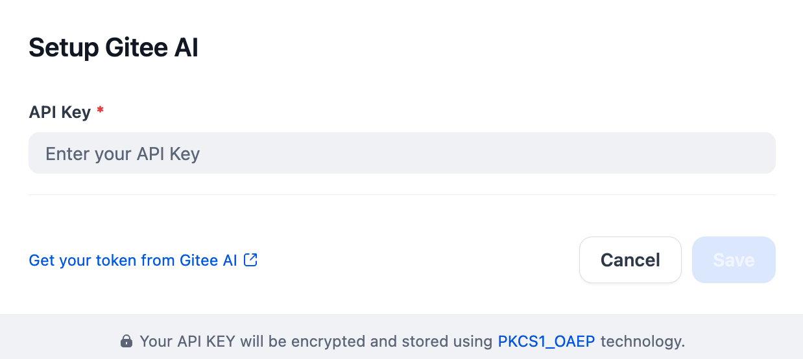

## Overview

Gitee AI is a suite of AI-powered tools integrated within the Gitee platform, designed to boost developer productivity. It encompasses features like code completion and static analysis, and utilizes advanced models such as the text-generation model `Qwen2.5-14B-Instruct`, the vision model `Qwen2-VL-72B-Instruct`, and the speech synthesis model fish-speech-1.5. Gitee AI enhances various development tasks, from writing code to creating visual content and audio. It aims to streamline workflows and offer intelligent assistance across coding, collaboration, and content generation within the Gitee environment.

## Configuration

After installing the plugin, configure the API key and API base within the Model Provider settings. Obtain your API key from [here](https://ai.gitee.com/dashboard/settings/tokens). Once saved, you can begin using Gitee AI to build your AI agents and agentic workflows.

