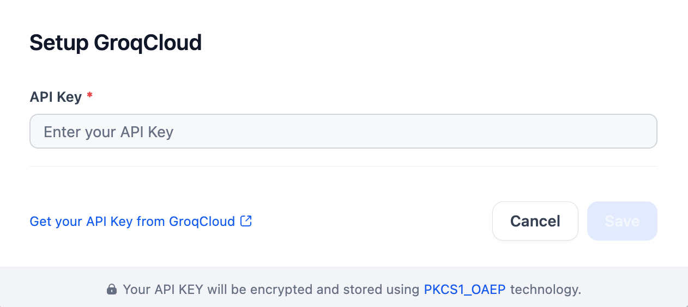

## Overview

GroqCloud is a cloud-based inference platform from Groq, delivering exceptionally fast AI inference for LLMs and speech-to-text (STT) models. With this plugin, developers can easily integrate GroqCloud's powerful models, including Llama and the Whisper family, into applications requiring low latency via its API.

## Configure

To use GroqCloud, you'll need your API key. After installing the plugin, find the Model Provider settings and enter the key you obtained from GroqCloud. Save to activate.

