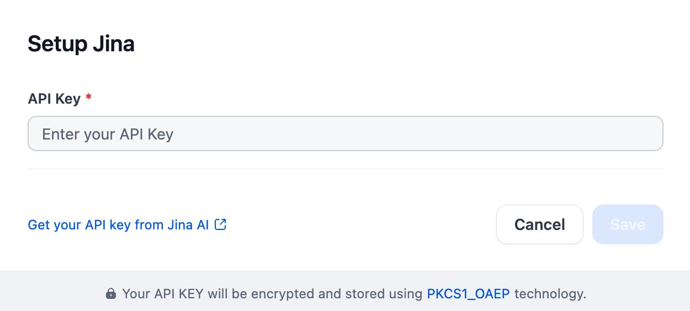

## Overview

Jina is a cloud-native neural search framework for building scalable, multimodal AI applications. It offers a robust ecosystem for indexing, querying, and retrieving various data types. Jina utilizes modular "Pods" for flexible search pipelines and supports diverse backends. Key components include `jina-clip-v2`, a model offering multilingual multimodal embeddings for text and images, and `jina-embeddings-v3`, providing multilingual embeddings with Task LoRA for fine-tuning. Jina enables developers to create sophisticated search, recommendation, and QA systems, streamlining AI development by making advanced functionalities more accessible and scalable.

## Configure

After installing the plugin, configure the API key and API base within the Model Provider settings. Obtain your API key from [here](https://jina.ai/). Once saved, you can begin using Jina to build your AI agents and agentic workflows.

