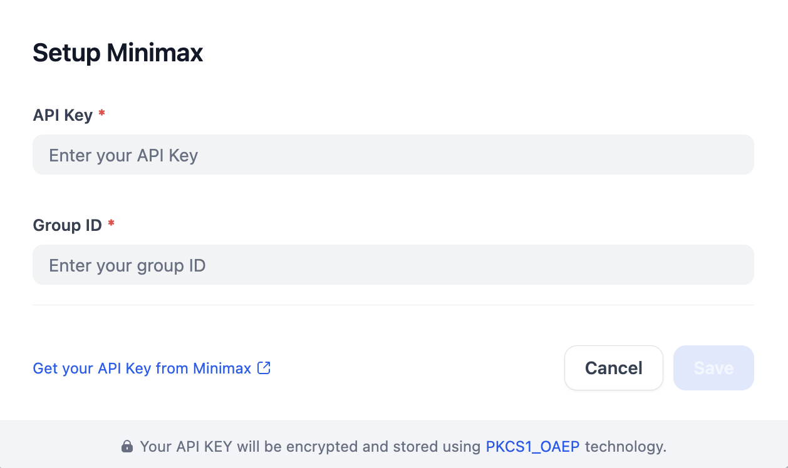

# Overview
MiniMax is an advanced AI platform that provides a suite of powerful models designed for various applications, including LLMs. 

# Configure
1. Install Minimax from Dify Marketplace.
2. Create a Minimax account and [get API keys](https://platform.minimaxi.com/user-center/basic-information/interface-key).
3. Fill in the configurations for Minimax in Settings -> Model Provider.

