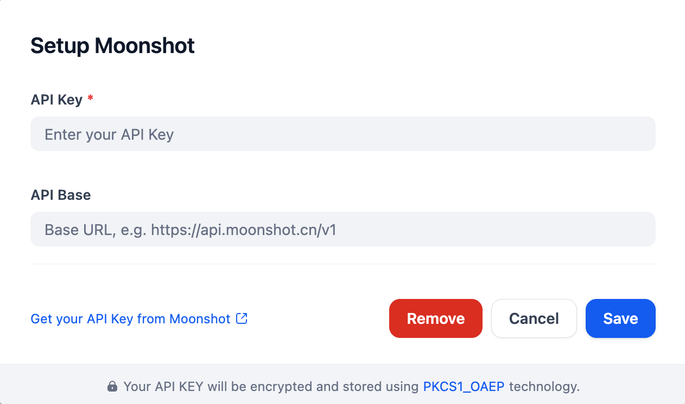

## Overview

This plugin provides access to Moonshot's moonshot-v1 series, offering LLMs with three context lengths for generating diverse text outputs, from short to long. The API supports function calling, enabling developers to connect tools in AI applications.

## Configure

After installing the plugin, configure the API key and API base within the Model Provider settings. Obtain your API key from here. Save to use Moonshot.

