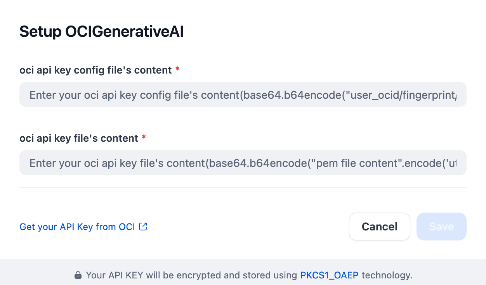

## Overview

[OCI Generative AI](https://www.oracle.com/ca-en/artificial-intelligence/generative-ai/generative-ai-service/) offers a range of pre-trained large language models (LLMs) and multimodal models for various AI tasks. It enables text generation, code generation, image creation, and content automation. These models support fine-tuning for specific applications. The platform allows users to build custom AI models leveraging these core functionalities. OCI Generative AI provides the infrastructure for secure and scalable deployment. It empowers users across industries with practical and diverse AI capabilities.

## Configure

After installing the plugin, configure the API key and API base within the Model Provider settings. Obtain your API key from [here](https://docs.cloud.oracle.com/Content/API/Concepts/sdkconfig.htm). Once saved, you can begin using OCI Generative AI to build your AI agents and agentic workflows.

