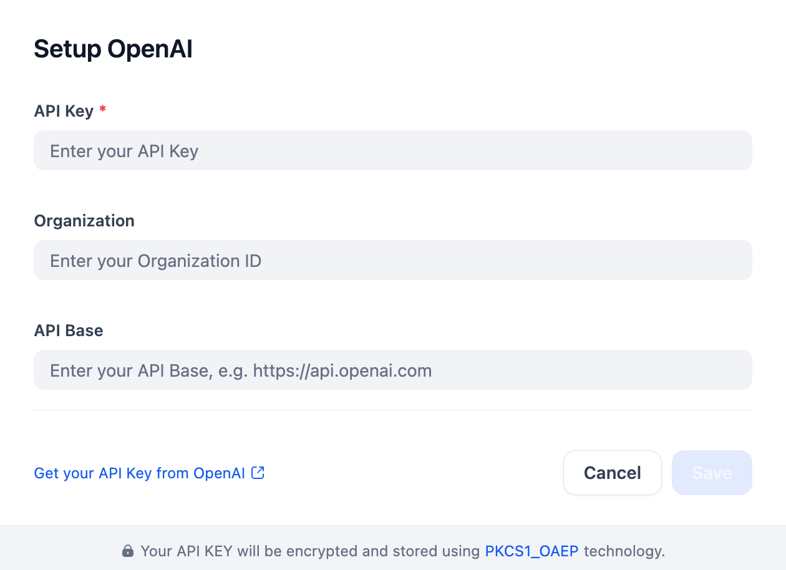

## Overview
OpenAI offers a comprehensive set of models for various tasks, including text generation, image generation, vision, audio generation, text-to-speech (TTS), speech-to-text (STT), embeddings, moderation, and reasoning.
This plugin allows developers to integrate LLMs such as GPT-3.5, GPT-4, and the o1 family (including custom fine-tuned versions) via the API, with support for function calling.

## Configure
After installing the plugin, configure your OpenAI settings in the Model Provider section. This includes your API key (find it [here](https://platform.openai.com/account/api-keys)) and optional Organization ID and API Base. Save to use OpenAI.

