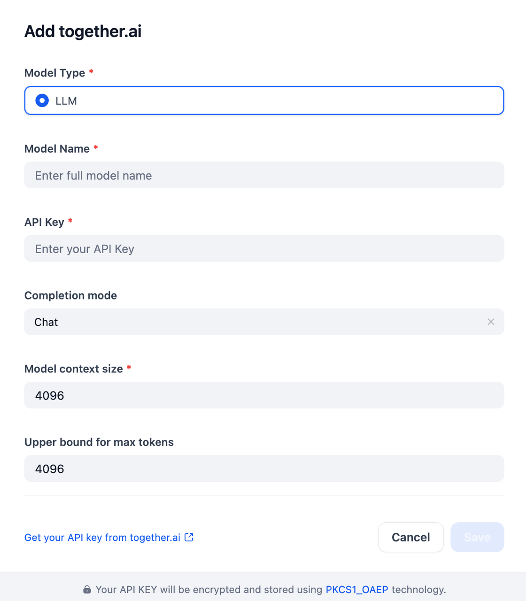

## Overview
[Together.ai](http://together.ai/) provides a cloud-based platform for building, training, and deploying AI models, with a focus on open-source LLMs and the ability to fine-tune existing models or build custom ones from scratch. This plugin provides access to [together.ai's](http://together.ai/) LLMs via model names and API keys.

## Configure
To configure [together.ai](http://together.ai/), specify the Model (Type and Name), your API Key (from [together.ai](http://together.ai/)), and the desired completion and size parameters. Save your settings.

