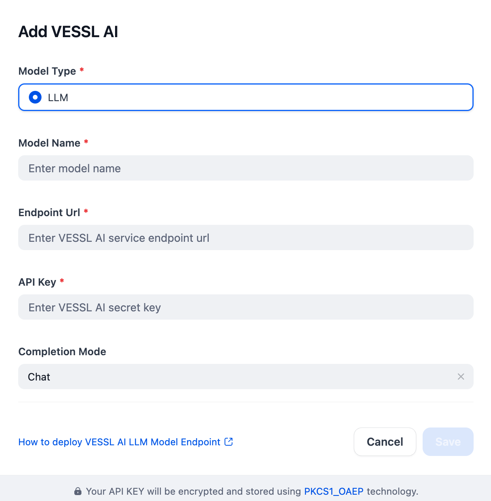

## Overview

[Vessl AI](https://vessl.ai/) is a platform that streamlines the machine learning workflow, offering tools for data, models, training, and deployment. The platform supports multiple frameworks and facilitates end-to-end AI development.

## Configure

Install the Vessl AI plugin, then configure it in Model Provider settings with the Model Name, Endpoint Url, API Key, and choose the Completion Mode. Get your API key from [Vessl AI](https://dashboard.cohere.com/api-keys) and save your settings.

