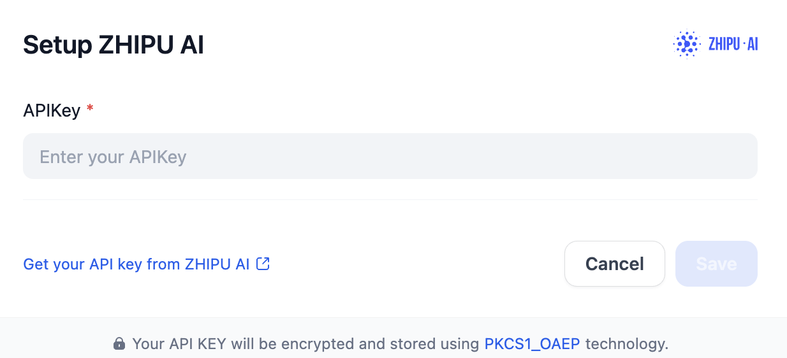

# Overview
Zhipu AI's ChatGLM is a series of advanced LLMs developed by Zhipu AI, designed to facilitate natural language understanding and generation. The ChatGLM models are particularly notable for their bilingual capabilities, excelling in both Chinese and English, and are optimized for various applications, including conversational agents, academic research, and business solutions.

# Configure
After installation, you need to get API keys from [Zhipu AI](https://open.bigmodel.cn/usercenter/apikeys) and setup in Settings -> Model Provider.

