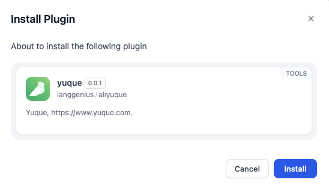

# Overview

The **Yuque Plugin** provides seamless integration with **Yuque (语雀)**, a powerful knowledge management and collaboration platform. This plugin includes a comprehensive set of tools to manage documents, books, and repositories programmatically within workflows.

Tools Included:
1. **Create Document**: Create a new document in a specified book.
2. **Delete Document**: Delete an existing document by its ID.
3. **Get Repo Index Page**: Retrieve the index page of a repository.
4. **Get Book's Table of Contents**: Fetch the table of contents for a specific book.
5. **Fetch Document Content**: Retrieve the content of a specific document.
6. **Get Doc Detail**: Fetch detailed metadata about a document.
7. **Update Book's Table of Contents**: Modify the table of contents for a book.
8. **Update Document**: Update the content or metadata of an existing document.

# Configure

1. Install the plugin.
1. Go to the **Dify Marketplace**.
2. Search for the **Yuque Plugin**.
3. Click "Install" to add the plugin to your workspace.

2. Obtain Yuque Team Token
1. Log in to your Yuque account at [Yuque](https://www.yuque.com/).
2. Navigate to your account settings and go to the [Tokens Page](https://www.yuque.com/settings/tokens).
3. Generate a new team token and copy it for use in Dify.

3. Authorize the Plugin
1. Add any of the Yuque tools (e.g., "Create Document" or "Fetch Document Content") to your workflow in Dify.
2. Click on the "To authorize" button in the tool configuration panel.
3. Enter your **Yuque Team Token** in the provided field.
4. Save your credentials to complete the authorization process.

4. Input Variables
Each tool requires specific input variables:

### Create Document
- Repo ID (String, Required): The ID of the repository where you want to create the document.
- Title (String, Required): The title of the new document.
- Content (String, Required): The content of the document.

### Delete Document
- Doc ID (String, Required): The ID of the document you want to delete.

### Get Repo Index Page
- Repo ID (String, Required): The ID of the repository whose index page you want to retrieve.

### Get Book's Table of Contents
- Book ID (String, Required): The ID of the book whose table of contents you want to fetch.

### Fetch Document Content
- Doc ID (String, Required): The ID of the document whose content you want to retrieve.

### Get Doc Detail
- Doc ID (String, Required): The ID of the document whose details you want to fetch.

### Update Book's Table of Contents
- Book ID (String, Required): The ID of the book whose table of contents you want to update.
- TOC Data (JSON String, Required): The updated table of contents in JSON format.

### Update Document
- Doc ID (String, Required): The ID of the document you want to update.
- Title (String, Optional): The new title for the document.
- Content (String, Optional): The updated content for the document.

# Example Workflow
1. Add the "Create Document" tool to your workflow in Dify.
2. Input:
  - `Repo ID`: `"123456"`
  - `Title`: `"New Project Plan"`
  - `Content`: `"This is a detailed project plan for Q1."`
3. Run the tool to create a new document in your specified repository.

4. Use "Fetch Document Content" or "Update Document" tools as needed for further operations on this document.