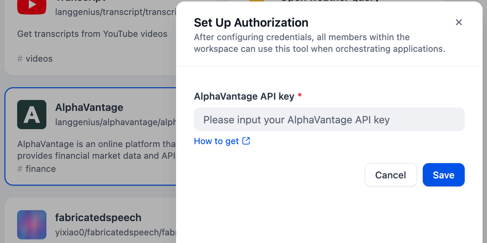
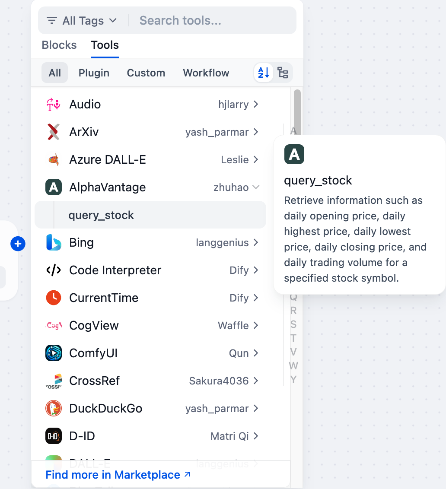

# Alpha Vantage API Tool

## Overview

Alpha Vantage provides an API service offering access to a wide range of financial market data. It allows developers to retrieve real-time and historical stock prices, forex rates, cryptocurrency data, and technical indicators. An API key grants access to these data endpoints, enabling integration into applications, analysis tools, and research projects.

## Configuration

### 1. Apply for AlphaVantage API Key
Please apply for an API Key on the [AlphaVantage](https://www.alphavantage.co/support/#api-key) homepage.

### 2. Get AlphaVantage tools from Plugin Marketplace
The AlphaVantage tools could be found at the Plugin Marketplace, please install it first.

### 3. On the Dify navigation page, click `Tools > AlphaVantage > Authorize` and fill in the API key.

### 4. You can use the AlphaVantage tool in the following application types.

#### Chatflow / Workflow applications

Both Chatflow and Workflow applications support the AlphaVantage tool node.

#### Agent applications

Add the AlphaVantage tool in the Agent application, then enter the stock code to call this tool.