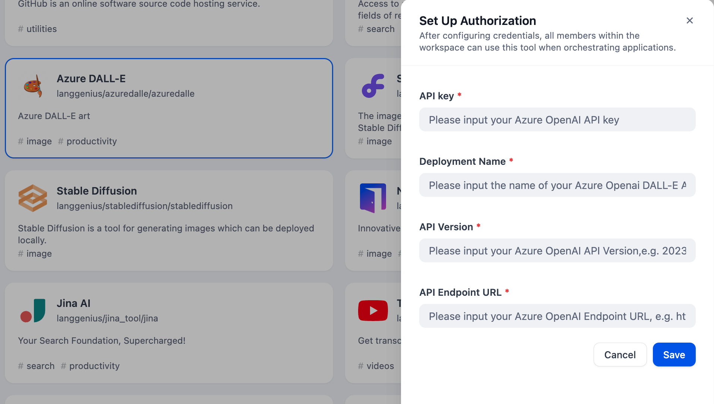
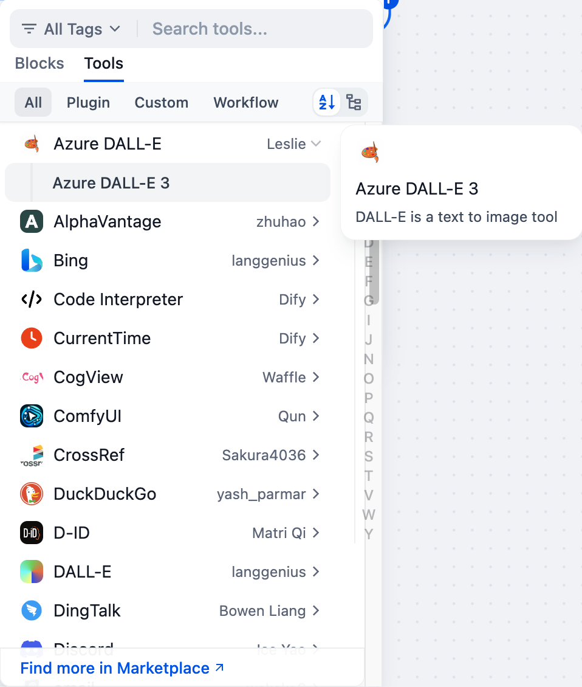

# Azure DALL-E

## Overview

Azure DALL-E is a service that provides access to advanced AI models for image generation. It allows developers and users to create images from textual descriptions, utilizing a powerful text-to-image model. The service offers features for image variations, inpainting, and outpainting, enabling diverse creative applications.

## Configuration

### 1. Apply for Azure DALL-E Account
Please follow [Azure instruction](https://learn.microsoft.com/en-us/azure/ai-services/openai/dall-e-quickstart?tabs=dalle3%2Ccommand-line%2Ckeyless%2Cjavascript-keyless%2Ctypescript-keyless&pivots=programming-language-studio) to sign in an Azure account, and to get API key, Deployment Name, etc.

### 2. Get Azure DALL-E tools from Plugin Marketplace
The Azure DALL-E tools could be found at the Plugin Marketplace, please install it.

### 3. Fill in the configuration in Dify
On the Dify navigation page, click `Tools > Azure DALL-E > To Authorize` and fill the API Key.

### 4. Use Tool
You can use the Azure DALL-E tool in the following application types.

#### Chatflow / Workflow applications
Both Chatflow and Workflow applications support adding a Azure DALL-E tool node for data processing tasks.

#### Agent applications
Add the Azure DALL-E tool in the Agent application, then enter data processing commands to call this tool.