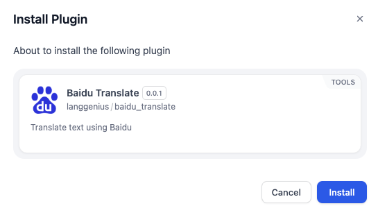
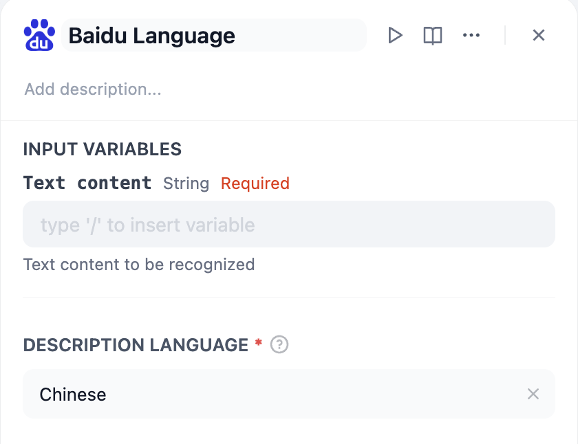
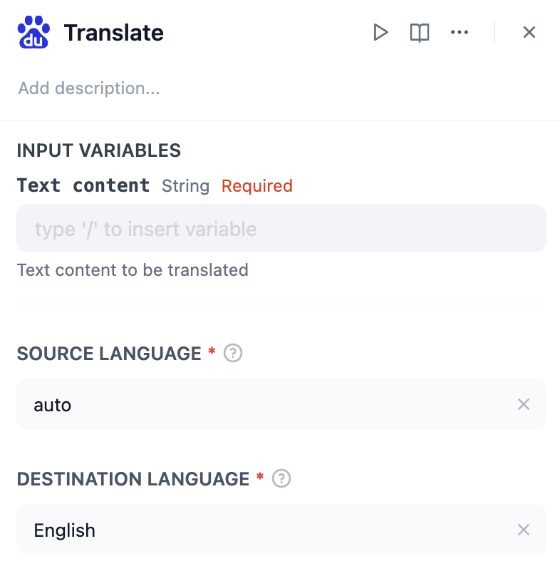

# Overview
The Baidu Translate plugin provides powerful language translation capabilities by leveraging Baidu's robust translation API. This plugin includes three tools: **Field Translate**, **Baidu Language**, and **Translate** designed to handle various translation tasks such as text translation, language detection, and field-specific translations.

# Configure
1. Go to the Dify Marketplace.
2. Search for the Baidu Translate Plugin.
3. Click "Install" to add the plugin to your workspace.

Before using the tools, you need to authorize the plugin with your Baidu Translate API credentials:
1. Go to [Baidu Translate](https://api.fanyi.baidu.com/register), and register as a developer.
2. Add any of the Baidu Translate tools (Field Translate, Baidu Language, or Translate) to your workflow.
3. Click on the "To authorize" button in the tool configuration panel.
4. Enter your Baidu Translate credentials:
  - AppID: Obtain it from [Baidu Translate API](https://api.fanyi.baidu.com/).
  - Secret: Generate it from [Baidu Translate API](https://api.fanyi.baidu.com/).
5. Save your credentials to complete the authorization process.
6. Fill in the required parameters for each tool, such as the text to translate, source and destination languages, and any other relevant information.

