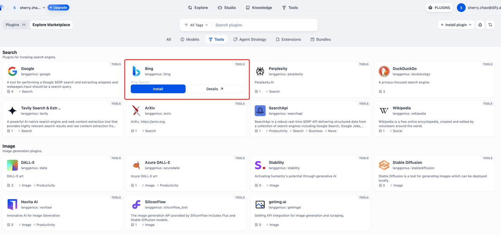
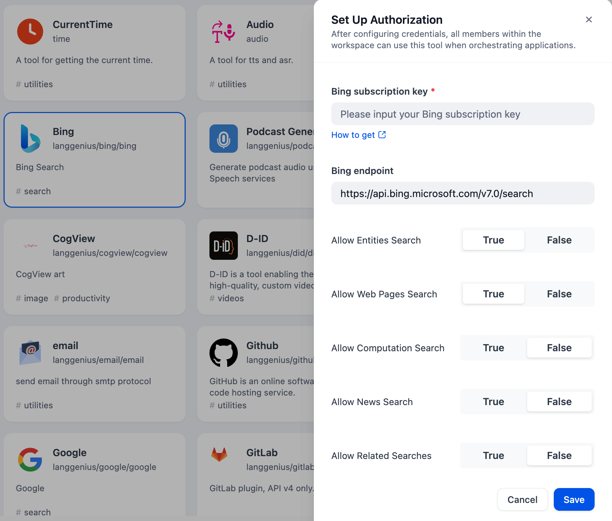
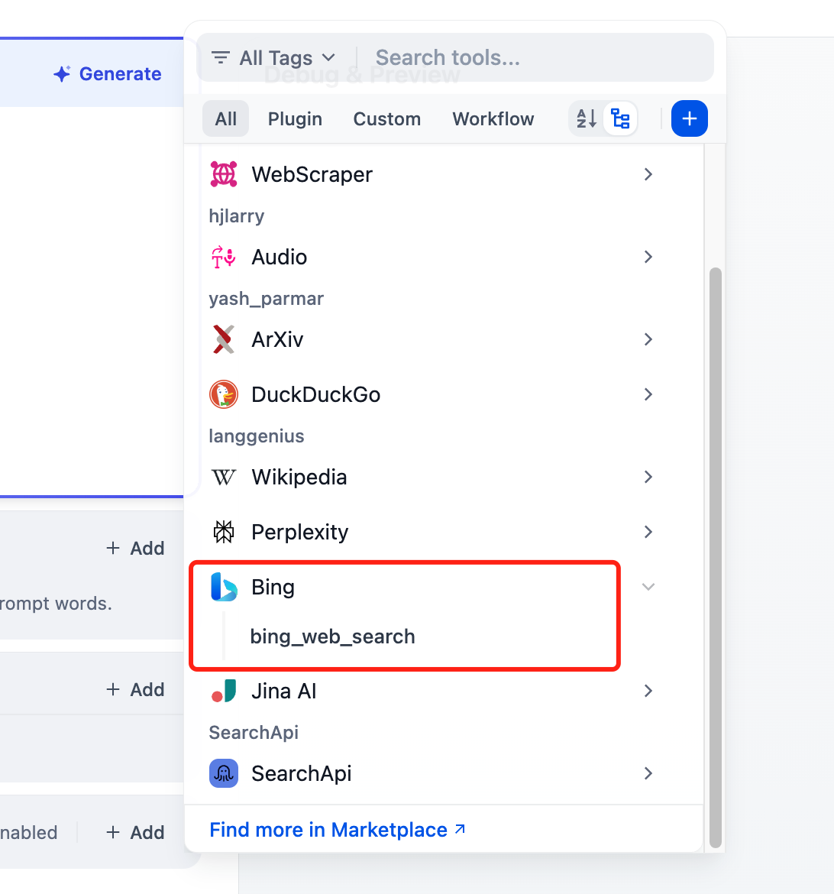

# Bing

## Overview

The Bing search tool can help you obtain online search results when using LLM applications. Below are the steps to configure and use the Bing search tool in Dify.

## Configuration

### 1. Apply for Bing API Key

Please apply for an API Key on the [Azure platform](https://www.microsoft.com/en-us/bing/apis/bing-web-search-api).

### 2. Get Azure tools from Plugin Marketplace

The Bing tools could be found at the Plugin Marketplace, please install it.

### 3. Fill in the configuration in Dify

On the Dify navigation page, click Tools > Azure > Authorize to fill in the API Key.

### 4. Use the tool

You can use the Bing tool in the following application types.

#### Chatflow / Workflow applications

Both Chatflow and Workflow applications support adding Bing tool nodes.

#### Agent applications

Add the Bing tool in the Agent application, then enter the online search command to call this tool.