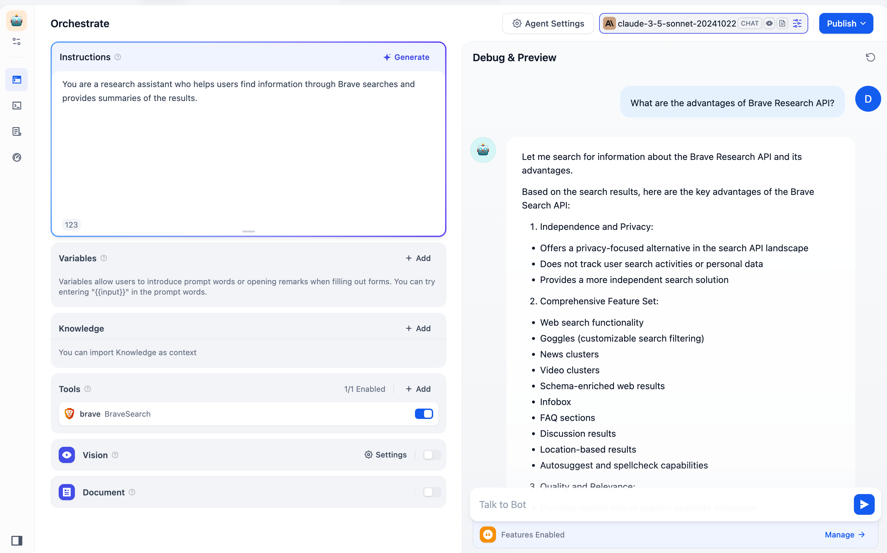
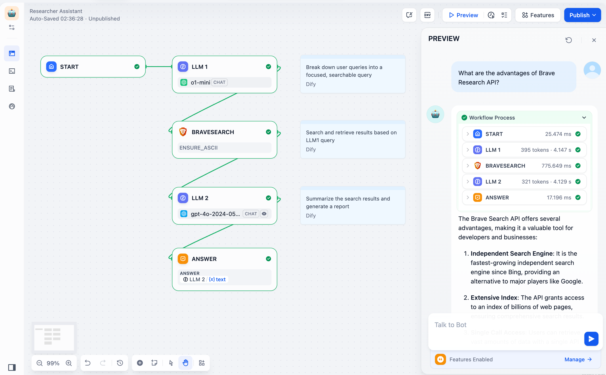
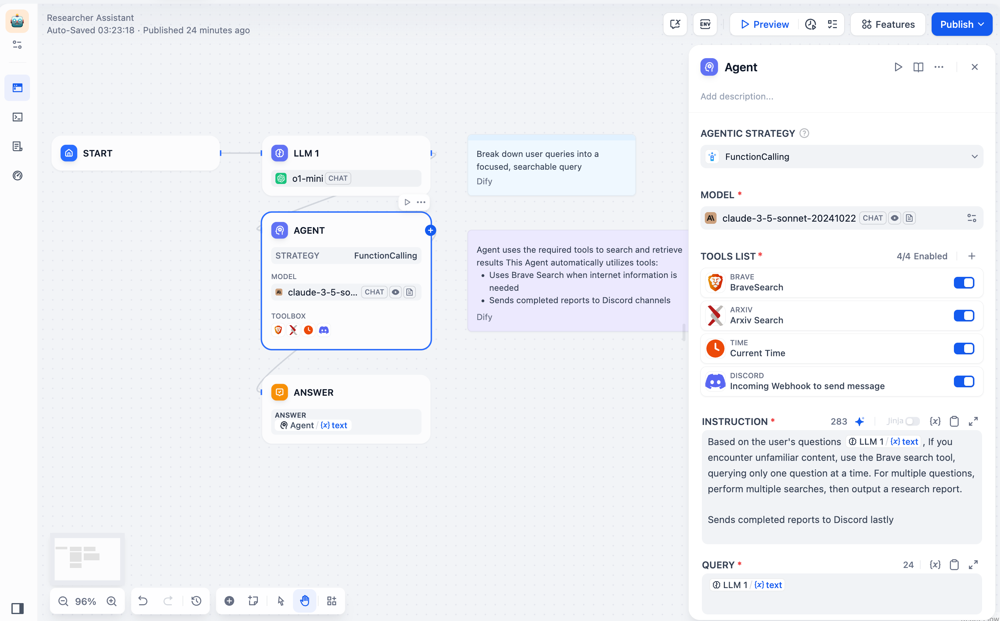

Brave Search offers programmatic web search capabilities, providing private, high-quality search results in various formats with comprehensive sources and an **intuitive structure**.

The Brave Search API plugin is now integrated into Dify and accessible within the Tools category. You can use this plugin after installation in three ways:

1. **Quick Chatbot Creation:** Create basic agents quickly by combining an LLM with the Brave Search tool.

2. **Standalone Tool in Workflows:** Enhance LLM workflows with accuracy search outcomes by deploying the Brave Search tool.

3. **Integration into Agent Nodes (Advanced Applications):** For more complex AI applications, integrate the Brave Search tool into Agent Nodes. Agent Nodes consist of three core components: **LLM + Tools + Strategies**:

   - **LLM:** The core of the Agent Node, responsible for reasoning, tool invocation, and strategy execution.  
   - **Tools:** Modules that extend LLM capabilities, such as **Brave Search**, image generation, web crawling, etc. You can customize and add tools.  
   - **Strategies:** Guidelines that direct how the LLM uses tools to solve problems. These include officially supported methods (Function Call and ReAct) as well as custom strategies you can create using Llamaindex, LangGraph, or other frameworks.

# Get Started

Equip your AI applications with powerful search capabilities using the Brave Search tool. Refer to the [documentation](https://brave.com/api/guides) for a detailed user guide.