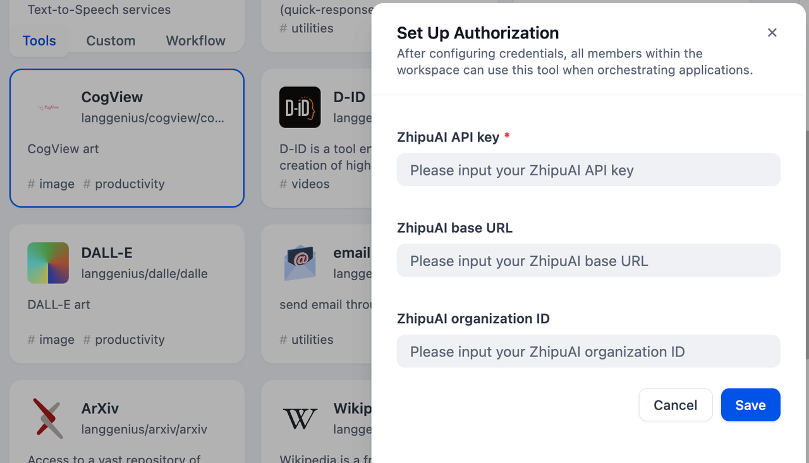
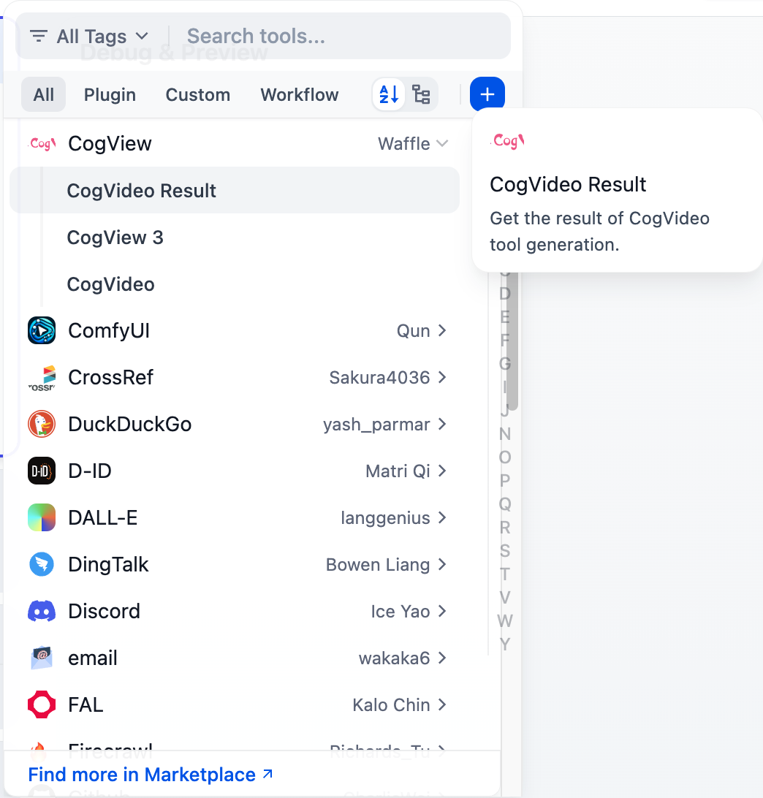

# CogView

## Overview

CogView is an AI model for text-to-image and text-to-video generation. It can create both images and videos based on textual descriptions provided by users. The model offers a variety of artistic styles and content generation options across both image and video formats.

## Configuration

### 1. Ensure that you are allowed to use the BigModel service
> If you don't have an account, go to the [BigModel site](https://bigmodel.cn/) and follow their instruction to create an account.

You can get the API key from the [ZHIPU AI OPEN PLATFORM](https://bigmodel.cn/).

### 2. Get CogView tools from Plugin Marketplace
The CogView tools could be found at the Plugin Marketplace, please install it.

### 3. Setup the CogView API in the Dify Tool page
On the Dify navigation page, click `Tools > CogView > To Authorize` and fill the API Key.

### 4. Using the tool
You can use the CogView tool in the following application types.

#### Chatflow / Workflow applications
Both Chatflow and Workflow applications support adding a CogView tool node.

#### Agent applications
Add the CogView tool in the Agent application, then enter online search instructions to call this tool.