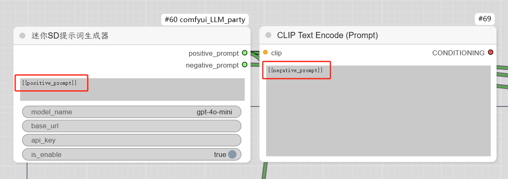
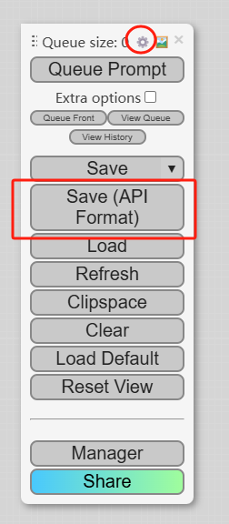
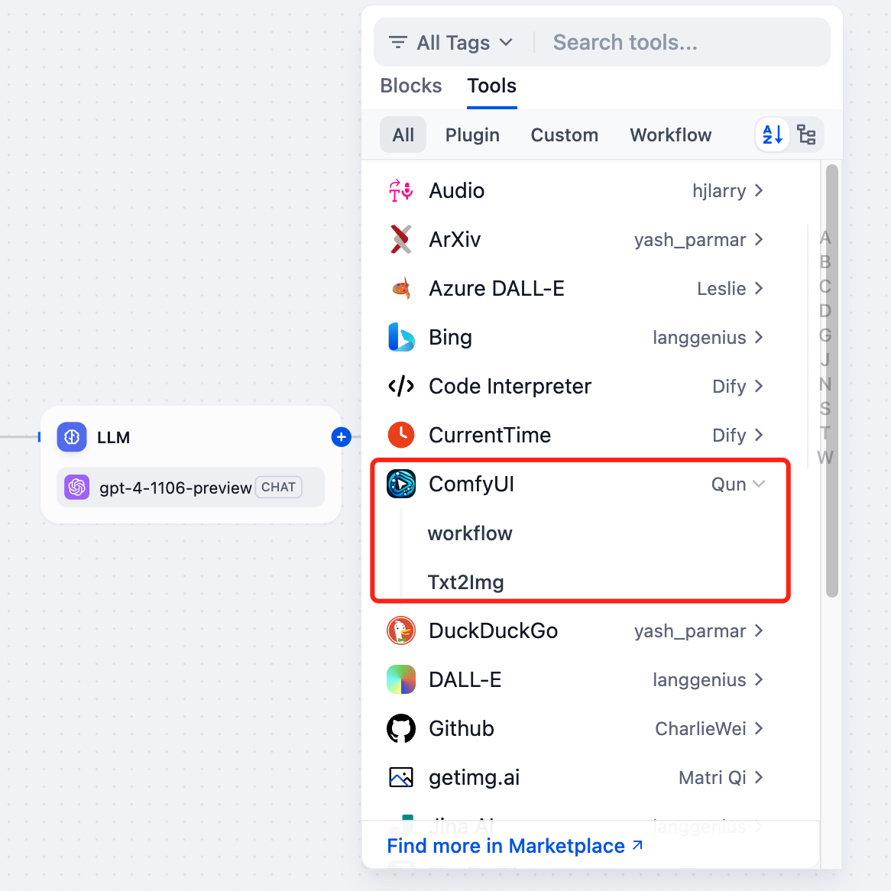

# ComfyUI

## Overview

[ComfyUI](https://www.comfy.org/) is the most powerful and modular diffusion model GUI, API and backend with a graph/nodes interface. Now you can use it in Dify, input the prompt or images, and get the generated image.

## Configuration

### 1. Ensure that the ComfyUI workflow is running normally

Please refer to its [official documentation](https://docs.comfy.org/get_started/gettingstarted) to ensure that ComfyUI can run normally and generate images.

### 2. Prompt setting

If you don't need Dify to pass in the prompt, you can skip this step. If your prompt node is connected to the only `KSampler` node in ComfyUI, you can skip this step.

Otherwise, use the string `{positive_prompt}` to replace the positive prompt content, and `{negative_prompt}` to replace the negative prompt content.

### 3. Export the API file of the workflow

As shown in the figure, select `Save(API Format)`. If there is no such selection, you need to enable `Dev Mode` in the settings.

### 4. Get ComfyUI tools from Plugin Marketplace

The ComfyUI tools could be found at the Plugin Marketplace, please install it first.

### 5. Integrate ComfyUI in Dify

On the Dify navigation page, click `Tools > ComfyUI > To Authentication` and fill in the URL of ComfyUI Server.

### 6. Use ComfyUI in Dify

You can use the ComfyUI tool in the following application types:

#### Chatflow / Workflow applications

Both Chatflow and Workflow applications support the `ComfyUI` tool node. After adding it, you need to fill in the "Input Variables → Prompt" in the node with variables to reference the user's input prompt or the content generated by the previous node. Finally, use the variable to reference the image output by `ComfyUI` in the "End" node.

#### Agent applications

Add the `ComfyUI` tool in the Agent application, then send a picture description in the dialog box to call the tool to generate an AI image.

### 7. Image input

Some ComfyUI workflows require multiple images inputs. In Dify, it will find every `LoadImage` node in the `WORKFLOW JSON` and fill in the image files input by the user in order. When you want to change this order, you can adjust it by filling in the `Image node ID list`. For example, if your workflow needs to input images into the 35th, 69th, and 87th nodes, then input `69,35,87` will pass the first image to the 69th node.