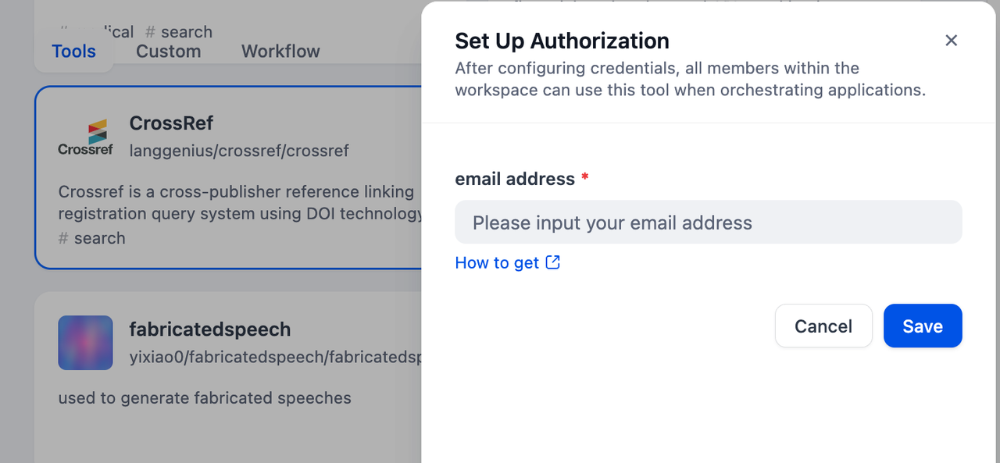
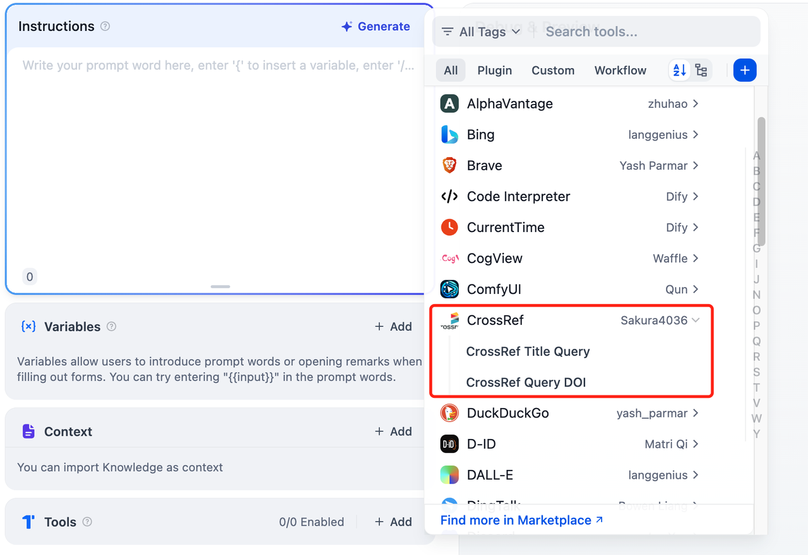

# CrossRef Integration and Usage in Dify

## Overview

CrossRef is a research discovery and linking tool. It helps researchers, librarians, and publishers find, connect, and cite scholarly publications. It leverages a vast database of metadata, offering features like similarity searches, citation lookups, and identifier resolution. In Dify, **it helps users to query literature information by DOI and by title**.

## Configuration

### 1. Get CrossRef tools from Plugin Marketplace

The CrossRef tools could be found at the Plugin Marketplace, please install it first.

### 2. Fill in the configuration in Dify

On the Dify navigation page, click `Tools > CrossRef > Authorize` and fill in your email address. For more details, please check [this link](https://api.crossref.org/swagger-ui/index.html#/).

### 3. Using the tool

You can use the CrossRef tool in the following application types:

#### Chatflow / Workflow applications

Both Chatflow and Workflow applications support the `CrossRef` tool node.

#### Agent applications

Add the `CrossRef` tool in the Agent application, then enter the literature command to call this tool.