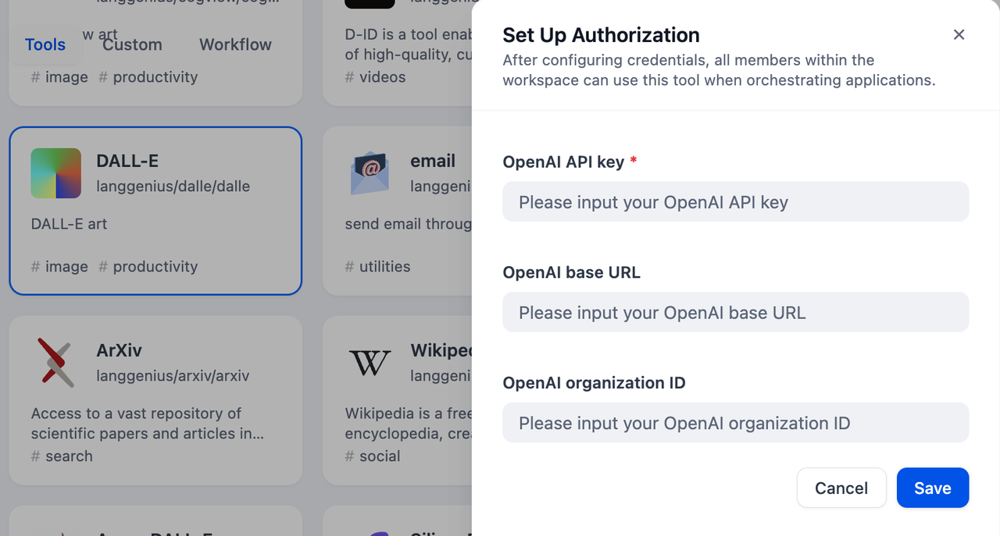
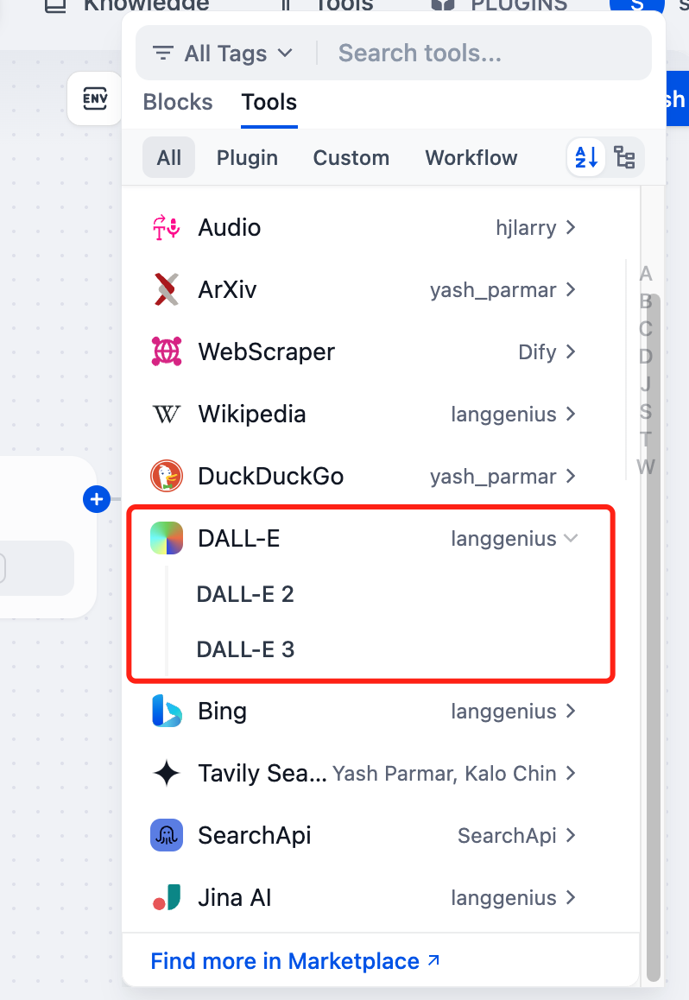
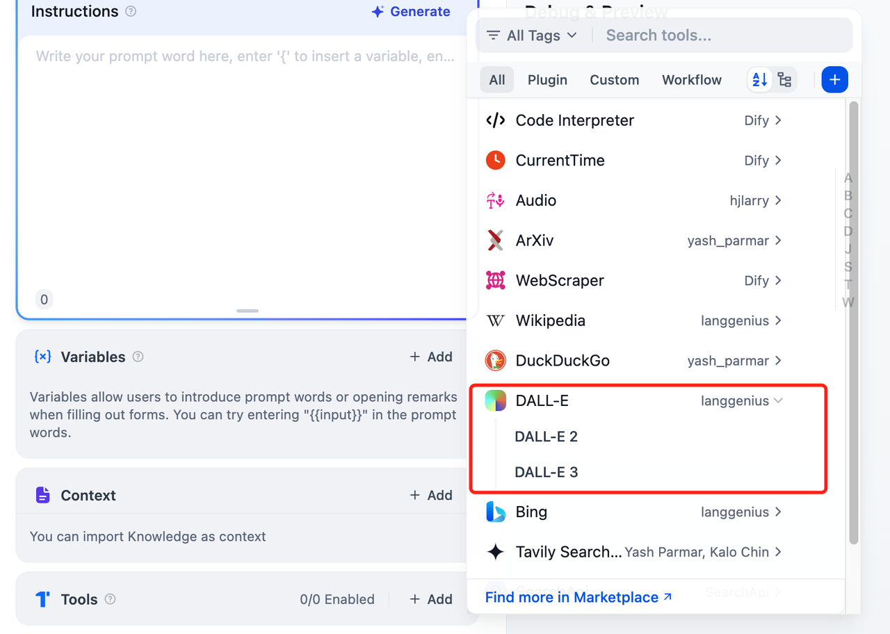

# DALL-E

## Overview

DALL-E is an AI image generator developed by OpenAI that generates images based on text prompts. Dify has integrated the DALL-E tool, and the following are the steps to configure and use the DALL-E tool in Dify.

## Configure

### 1. Apply for Dall-E API Key

Please apply for an API Key on the [OpenAI Platform](https://platform.openai.com/).

### 2. Get Dall-E tools from Plugin Marketplace

The Dall-E tools could be found at the Plugin Marketplace, please install it first.

### 3. Fill in the configuration in Dify

On the Dify navigation page, click `Tools > DALL-E > Authorize` and fill in the API Key.

**Note:** Base URL and Organization ID are optional. The Organization IDs can be found on your [Organization settings](https://platform.openai.com/settings/organization/general) page.

### 4. Use the tool

You can use the Dall-E tool in the following application types:

#### Chatflow / Workflow applications

Both Chatflow and Workflow applications support the `DALL-E` tool node. After adding it, you need to fill in the "Input Variables → Prompt" in the node with variables to reference the user's input prompt or the content generated by the previous node. Finally, use the variable to reference the image output by `DALL-E` in the "End" node.

#### Agent applications

Add the Dall-E tool in the Agent application, then send a picture description in the dialog box to call the tool to generate an AI image.
