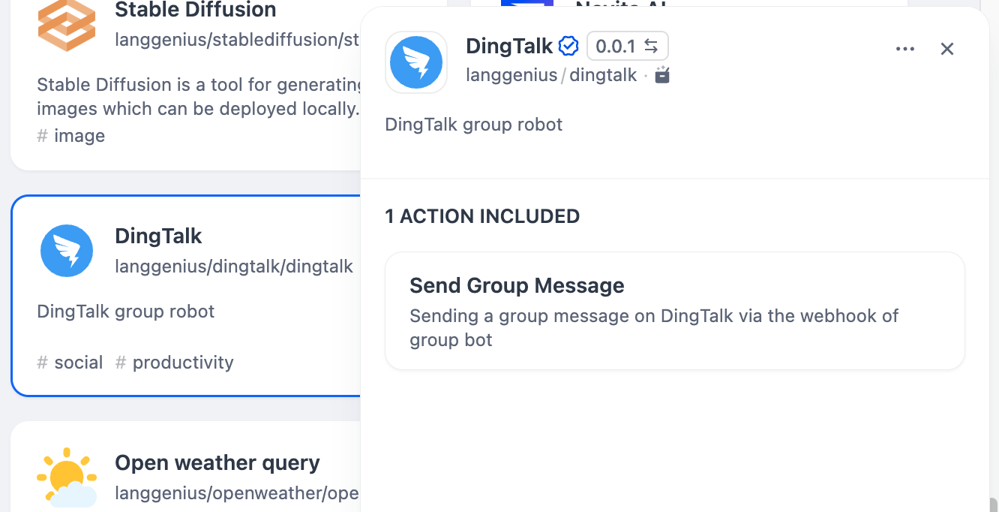
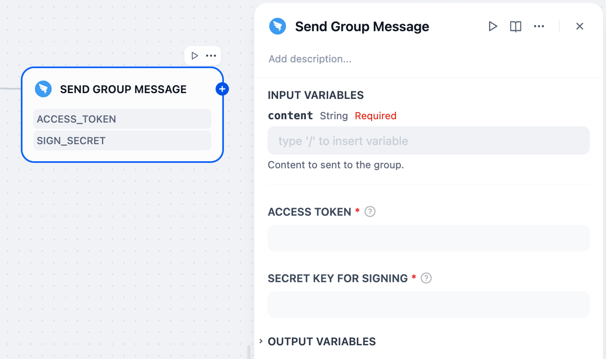

# DingTalk Tool

## Overview

DingTalk is a communication and collaboration platform designed for workplace environments. It offers features like instant messaging and group chats.

## Configuration

### 1. Apply for DingTalk Account

Get Access Token and ApiSecret from [DingTalk developer platform](https://open-dev.dingtalk.com/?spm=ding_open_doc.document.0.0.66d876e0V8Gchn), for more getting tutorial:

- **Access Token**: 
https://open.dingtalk.com/document/orgapp/obtain-user-token

- **ApiSecret**: 
https://open.dingtalk.com/document/connector/untitled-document-2

### 2. Get DingTalk tools from Plugin Marketplace
The DingTalk tools could be found at the Plugin Marketplace, please install it.

### 3. You can use the DingTalk tool in the following application types.

#### Chatflow / Workflow applications

Both Chatflow and Workflow applications support the DingTalk tool node, and fill up the node with all the information from **Step 1**.