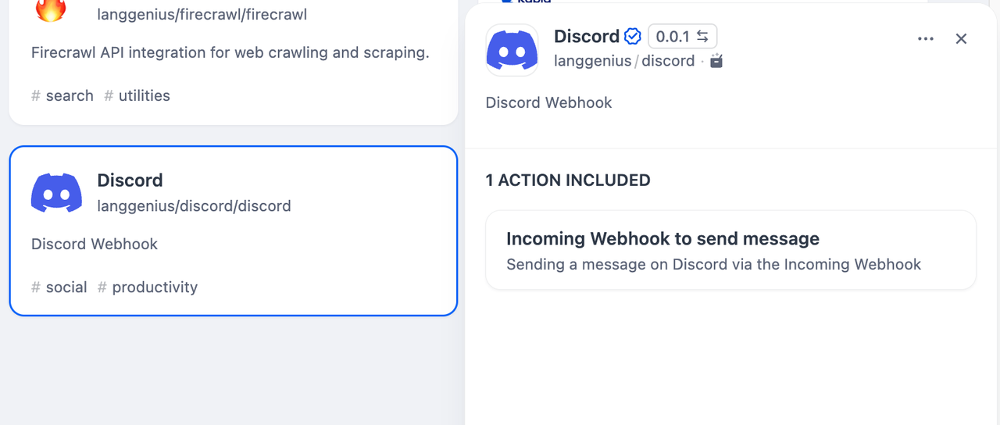
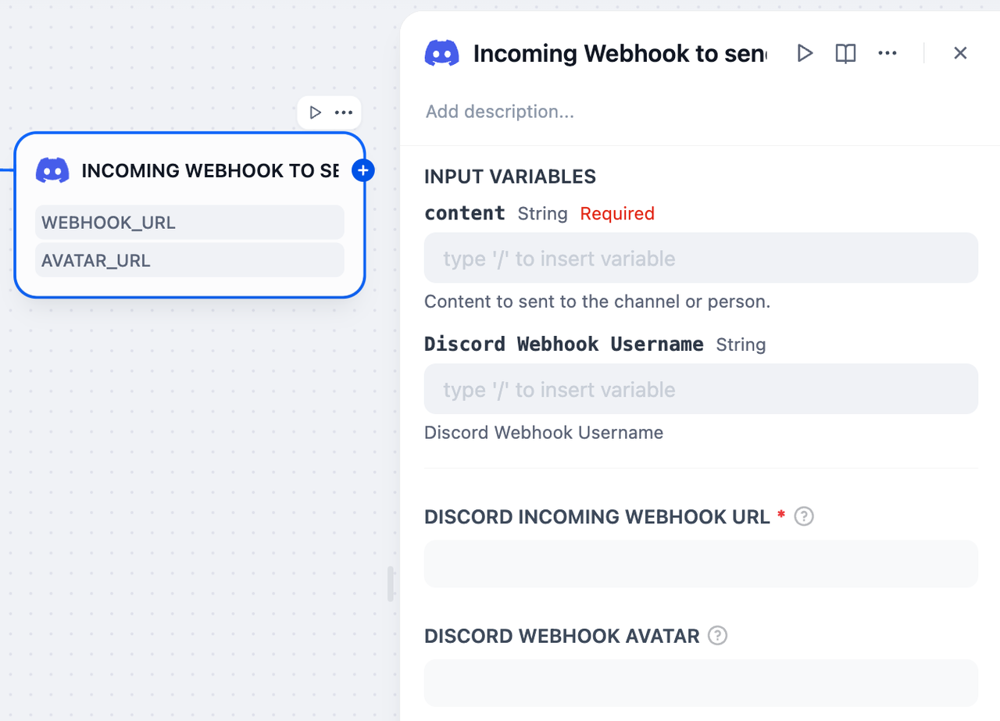

# Discord Tool

## Overview

Discord is a communication platform designed for communities. It offers features like text and voice channels, direct messaging, and server-based organization. In Dify, Discord tools allow users to create a random bot with random username and avatar to send messages.

## Configuration

### 1. Get Discord webhook url
Please follow [this site](https://support.discord.com/hc/en-us/articles/228383668-Intro-to-Webhooks) to create a webhook and get its url.

### 2. Get Discord tools from Plugin Marketplace
The Discord tools could be found at the Plugin Marketplace, please install it first.

### 3. Use the tool
You can use the Discord tool in the following application types.

#### Chatflow / Workflow applications

Both Chatflow and Workflow applications support adding a `Discord` tool node.

#### Agent applications
Add the Discord tool in the Agent application, then fill in the `discord incoming webhook url` to call this tool.