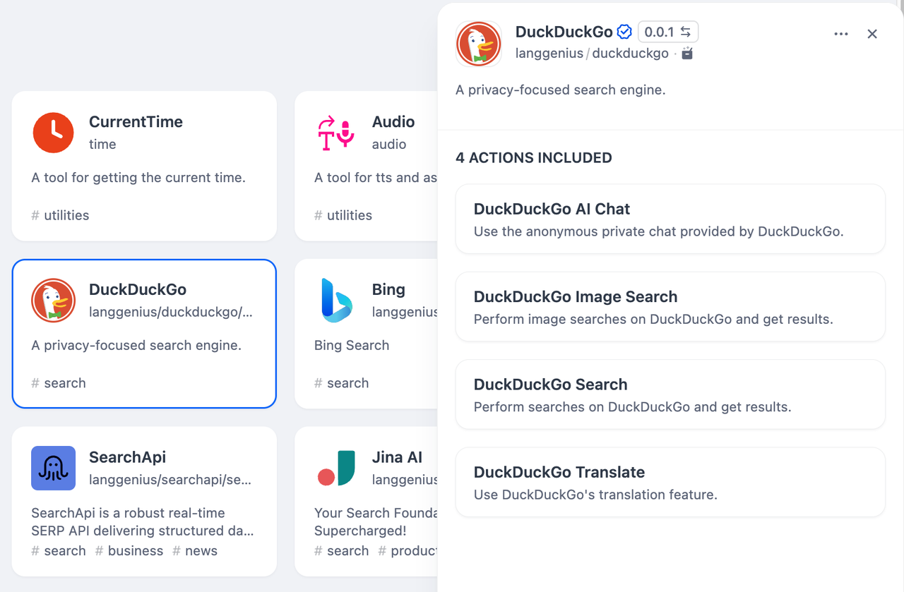
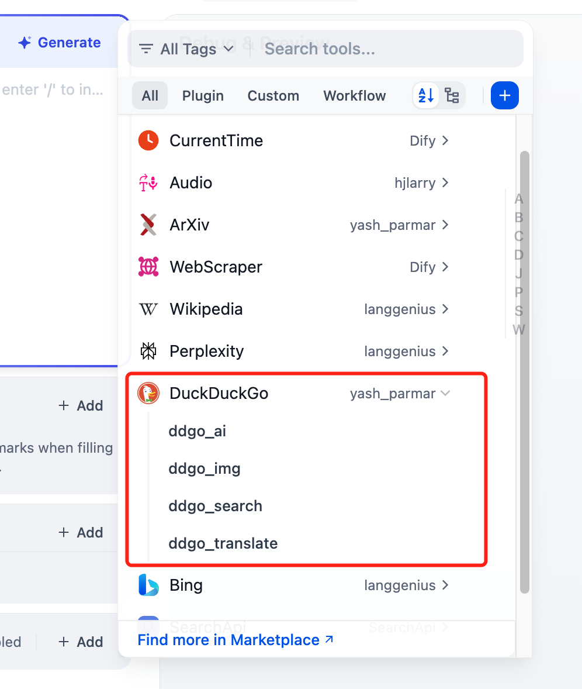

# Duckduckgo

## Overview

DuckDuckGo is a search engine focused on privacy. It offers search capabilities for web pages, images, and provides translation services. DuckDuckGo also features a private AI chat interface, providing users with an AI assistant that prioritizes data protection.

## Configuration

### 1. Get DuckDuckGo tools from Plugin Marketplace

The DuckDuckGo tools could be found at the Plugin Marketplace, please install it first.

### 2. Use the tool

You can use the DuckDuckGo tool in the following application types.

#### - Chatflow / Workflow applications

Both Chatflow and Workflow applications support adding DuckDuckGo tool nodes, it provides four tools: ai chatbox, image search, simple search, and translation.

#### - Agent applications

Add the DuckDuckGo tool in the Agent application, then enter the search command to call this tool.