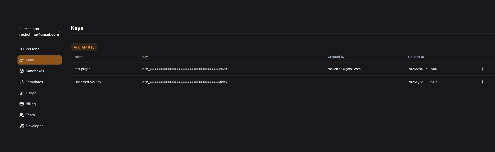
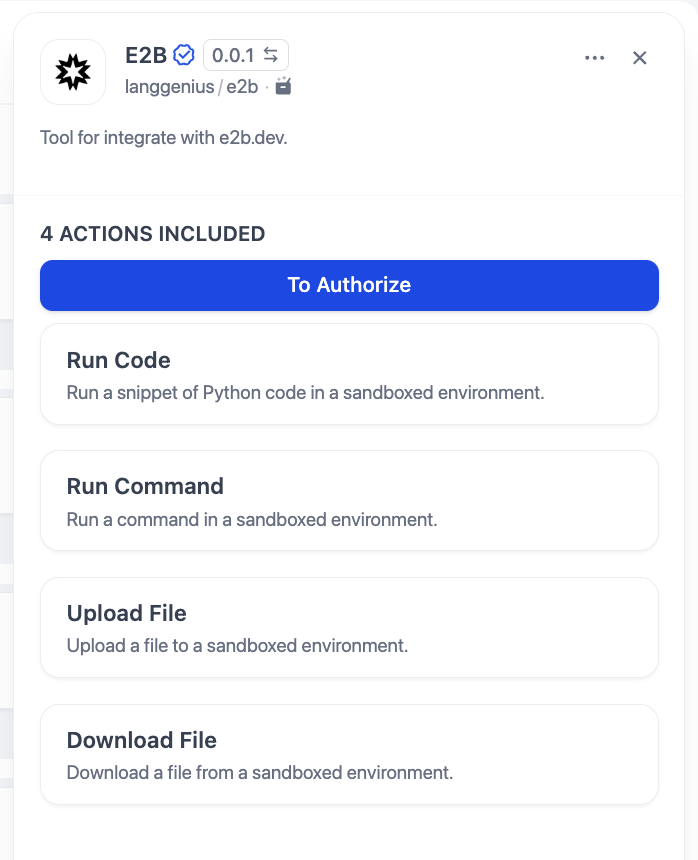
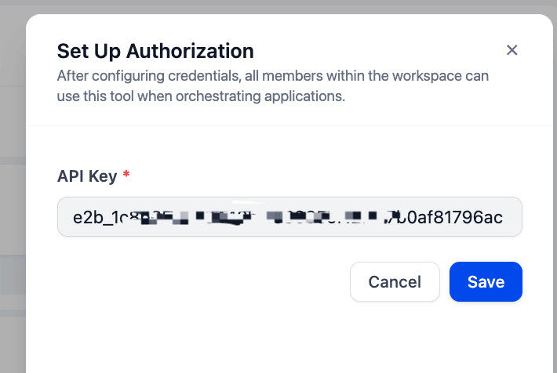
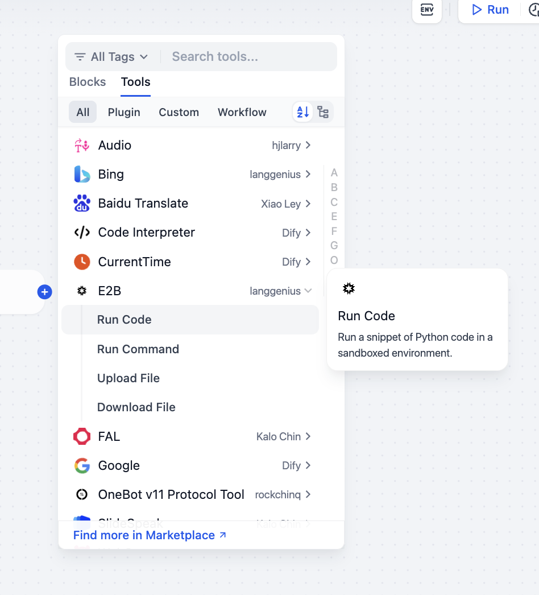
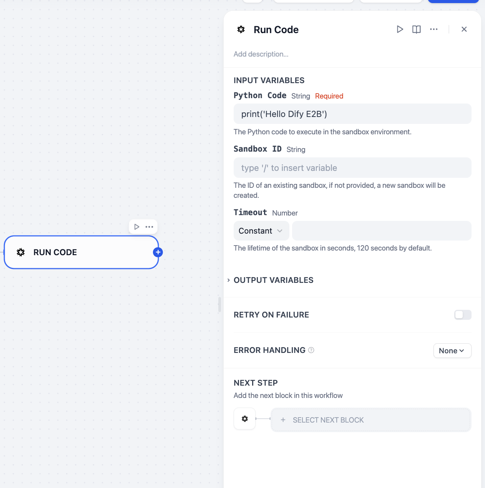
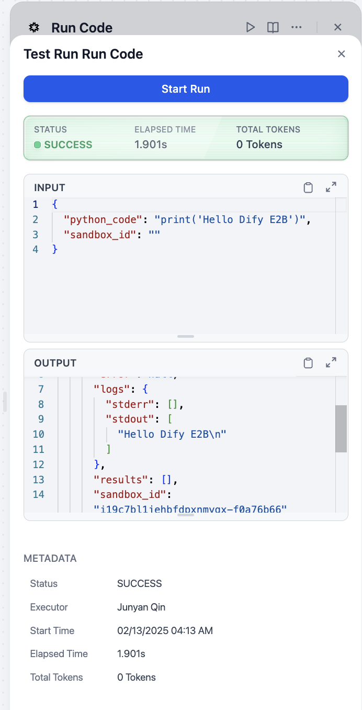
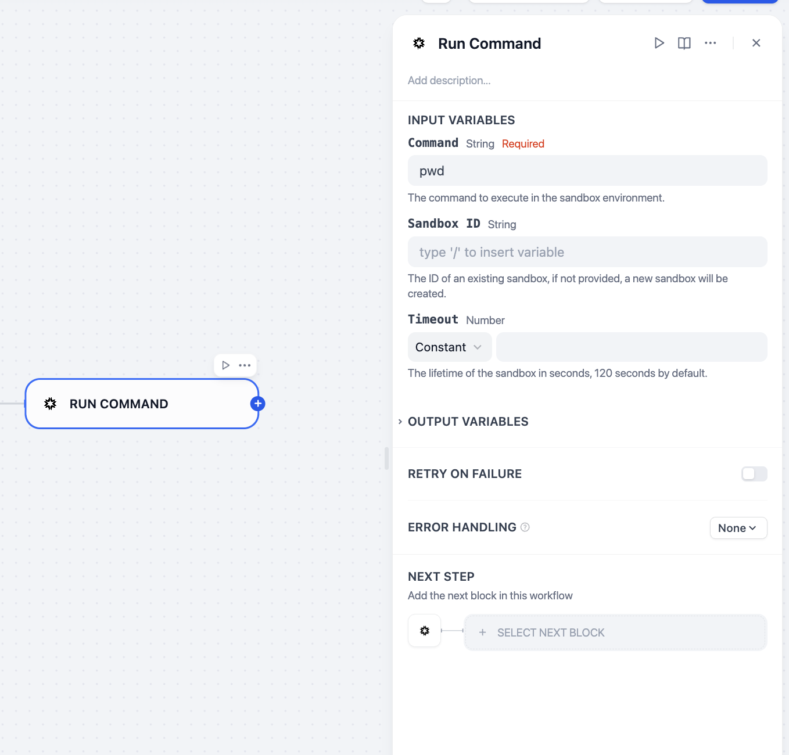
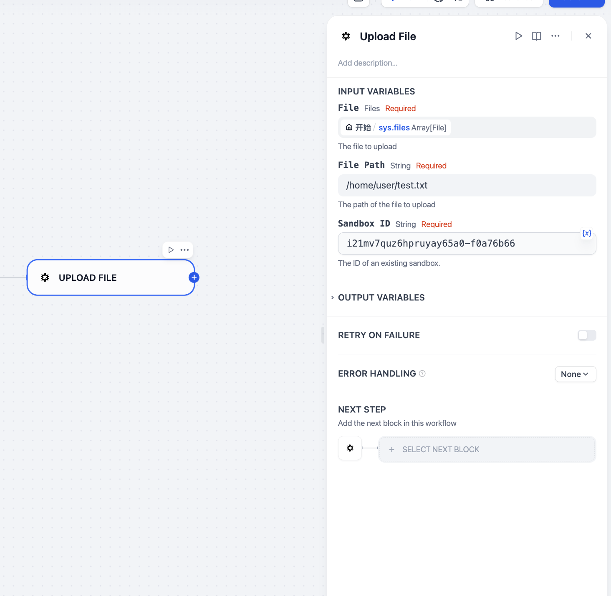
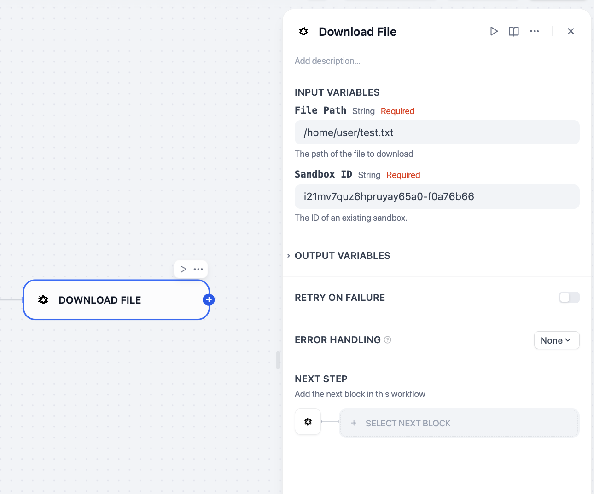

## e2b

### Description

This is a plugin for Dify to integrate with e2b.dev. It allows you to run code in a sandboxed environment.

### Features

- Run code in a sandboxed environment.
- Run command in a sandboxed environment.
- Upload file to a sandboxed environment.
- Download file from a sandboxed environment.

### Usage

Login to [e2b.dev](https://e2b.dev), get your API key from `Keys` page.

Install this plugin in Dify, click on `To Authorize` button, paste your API key, and click on `Authorize` button.

Then you can use the tool in your workflow or other apps.

#### Run Code

Currently supports Python and JavaScript code.

#### Run Command

Run a Linux command in a sandboxed environment.

#### Upload/Download File

Upload a file to a sandboxed environment.

Download a file from a sandboxed environment.

Note that these two file operations require an existing sandbox.
