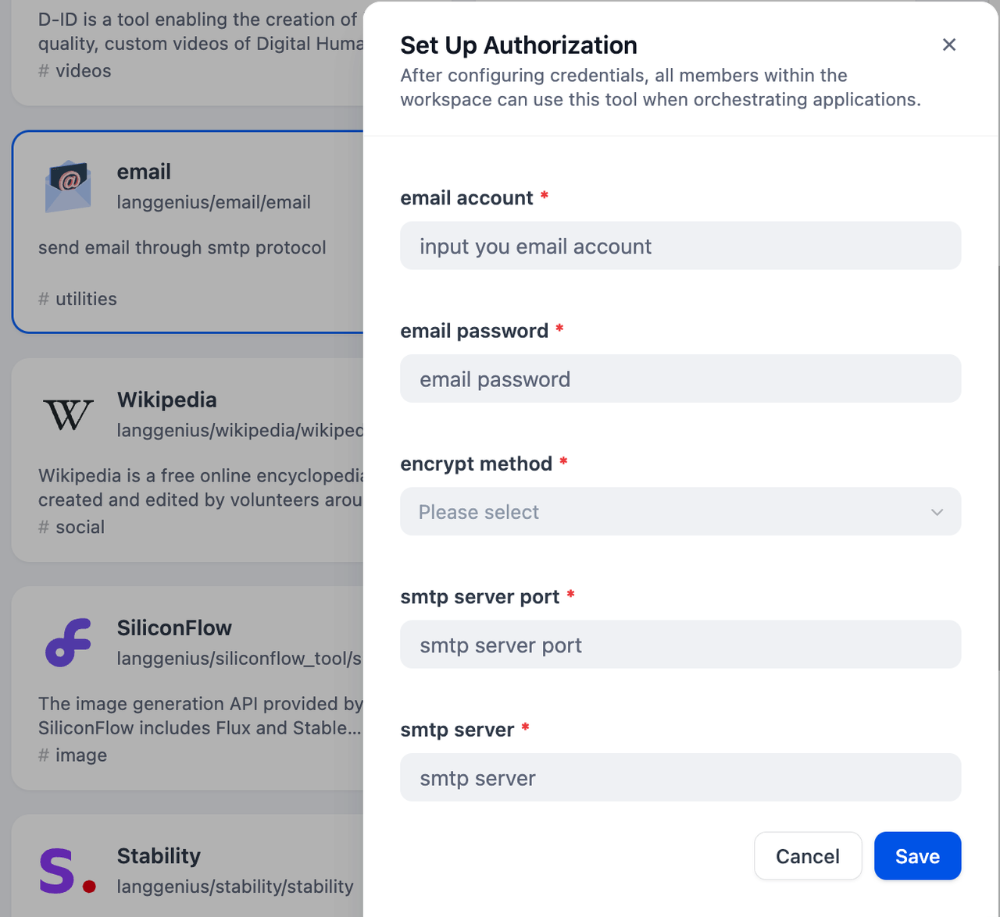
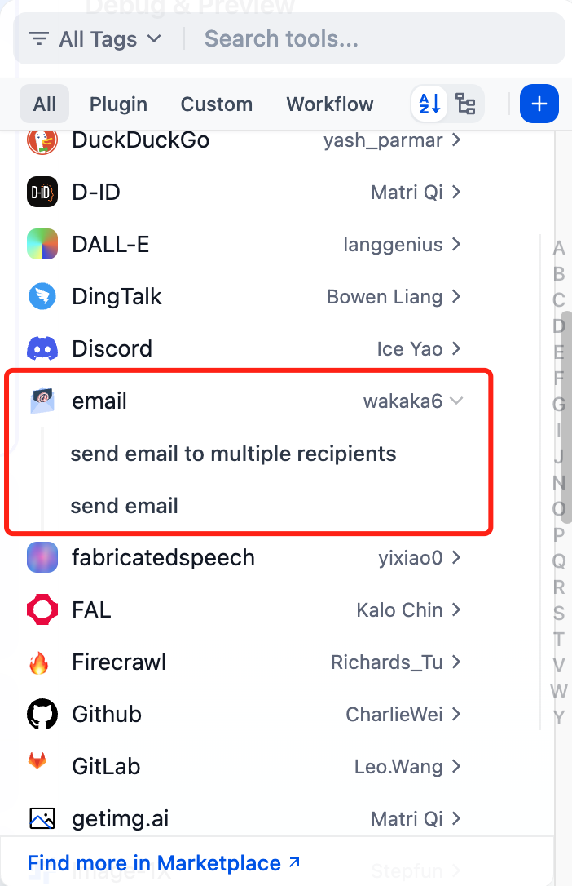

# Email

## Overview

The email is a method of electronic communication for sending and receiving information through the Internet. This tool helps users to send emails to one person or to multiple recipients.

## Configuration

### 1. Get email tools from Plugin Marketplace

The email tools could be found at the Plugin Marketplace, please install it first.

### 2. Fill in the configuration in Dify

On the Dify navigation page, click `Tools > email > To authorize`.

**Note**: If your email account is gmail, please use "START TLS" as encrypt method, the smtp server is smtp.gmail.com, and the port is 587. For other common email service settings, please check this [manual](https://docs.mattermost.com/configure/smtp-email.html#sample-smtp-settings).

### 3. Use the tool

You can use the email tool in the following application types.

#### Chatflow / Workflow applications
Both Chatflow and Workflow applications support adding a `email` tool node.