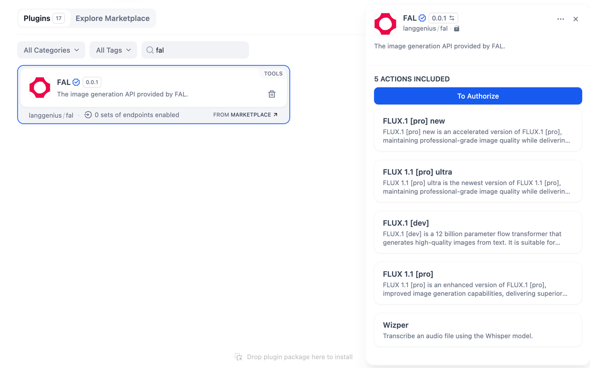
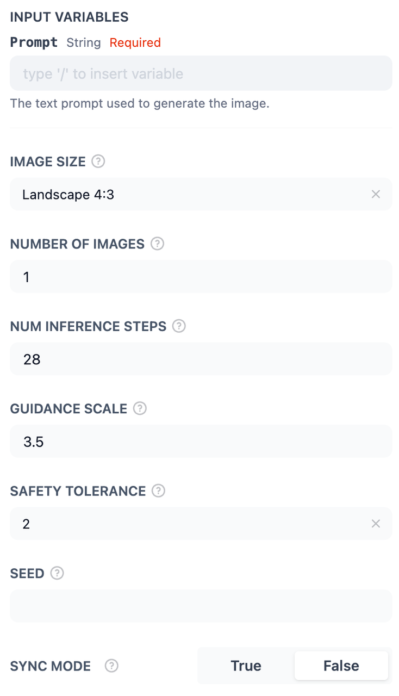
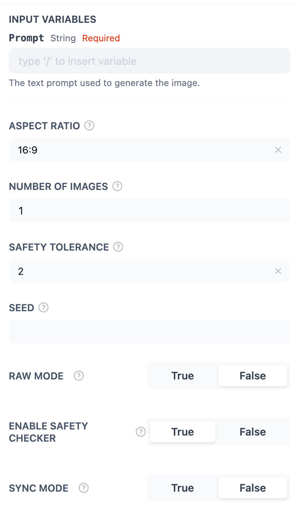
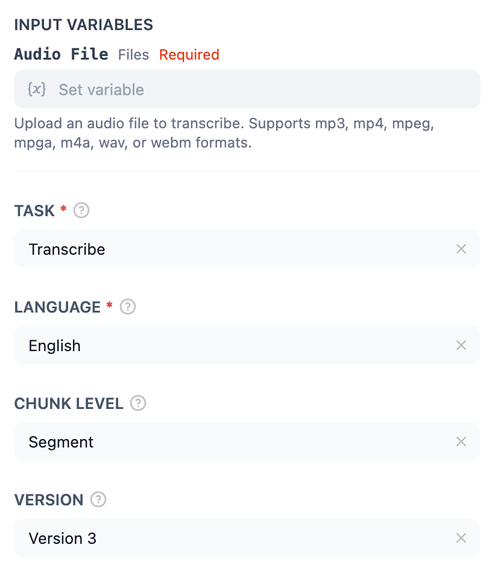
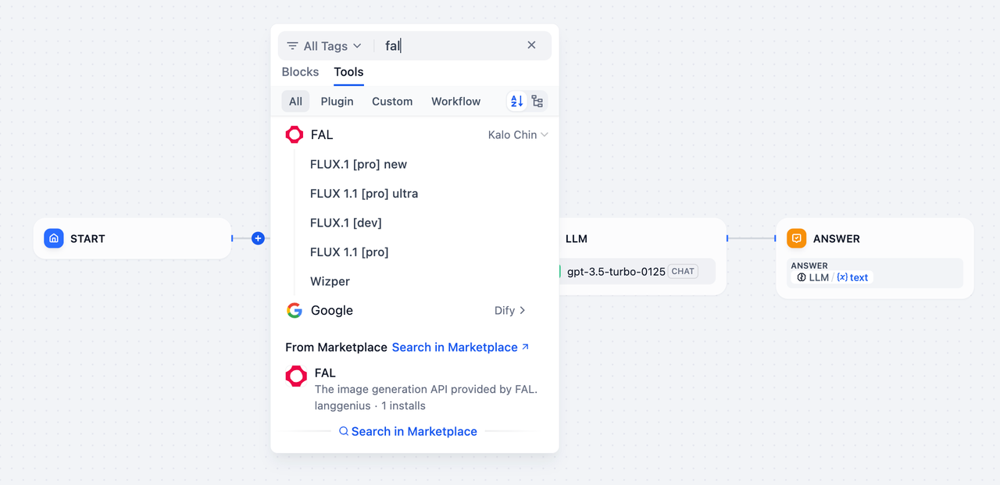

## Overview

**FAL** is an advanced suite of tools designed for AI-powered image generation and audio transcription. In **Dify**, FAL provides multiple services, including image creation with models like **FLUX.1 [pro]** and **FLUX 1.1 [pro] ultra**, allowing users to generate high-quality visuals with customizable parameters. Additionally, FAL offers **Wizper**, a transcription tool that converts audio files into text with precision, supporting various languages and flexible chunk-level configurations.

## Configuration

To start using FAL, follow these steps:

1. **Install FAL Tool**
Download and install the FAL tool from the Plugin Marketplace to integrate it into your workflows.

2. **Apply for FAL API Key**
Go to the FAL API Keys page, create a new API Key, and ensure that your account is properly set up with the required access and balance.

3. **Authorize FAL**
Navigate to **Tools > FAL > To Authorize** in Dify, and input your API Key to enable the tool.

## Tool Features

The FAL tool provides five actions for image generation and audio transcription.

### FLUX.1 [PRO] NEW

An optimized version of **FLUX.1 [PRO]**, designed for faster processing while maintaining professional-grade image quality. Simply follow the UI instructions to input the required parameters and use the tool to generate high-quality images.

### FLUX 1.1 [PRO] ULTRA

The latest and most advanced version of FLUX.1 offers superior image quality and efficiency. Recommended for users seeking cutting-edge performance.

### FLUX.1 [DEV]

A 12-billion parameter flow transformer model optimized for high-quality image generation from text. Best suited for experimental or custom use cases.

### FLUX 1.1 [PRO]

An enhanced version of FLUX.1 [pro], delivering improved image generation capabilities with exceptional detail and clarity. Ideal for professional projects.

### Wizper

A transcription tool powered by the Whisper model, designed to convert audio files into text with high accuracy.

## Usage

### Chatflow / Workflow Apps

1. Add the FAL node into your Chatflow or Workflow pipeline.
2. Select one of FAL's actions (e.g., FLUX.1 [pro] ultra for high-quality image generation).
3. Input the required parameters, such as text prompts for image generation or audio files for transcription.
4. Execute the pipeline to generate images or transcribe audio data.

### Agent Apps

1. Add the FAL tool to the Agent application.
2. Send the desired text prompt or upload an audio file to generate an image or transcribe the content.
3. Use the generated image or transcription in real-time applications to enhance user interaction and functionality.

By combining the capabilities of FAL's image generation and transcription tools, you can streamline workflows, enhance creativity, and optimize productivity.
