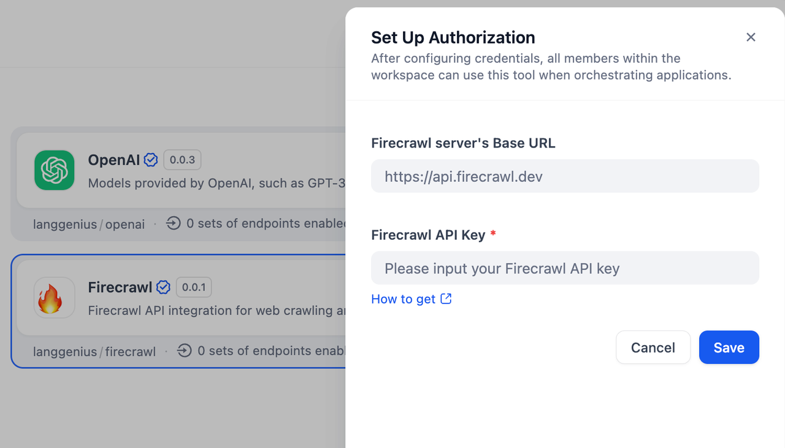
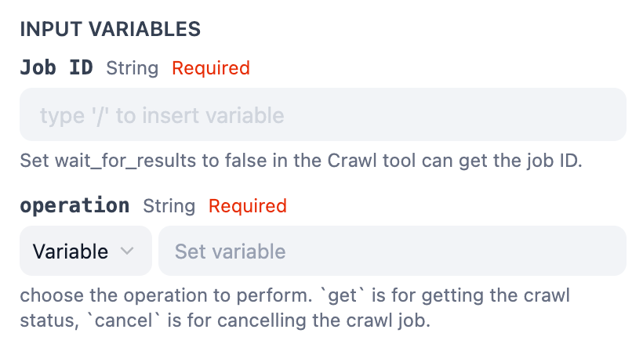
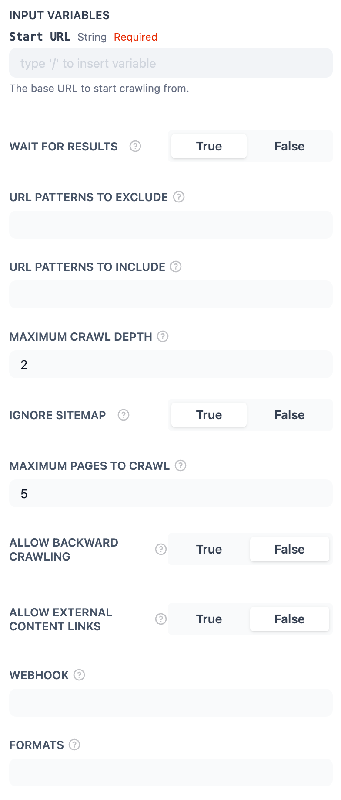
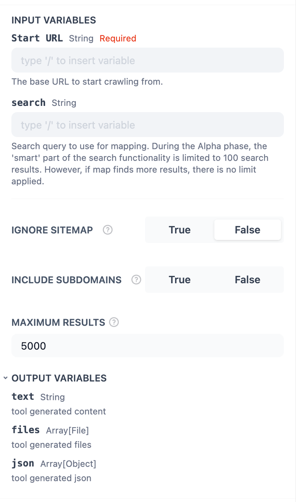
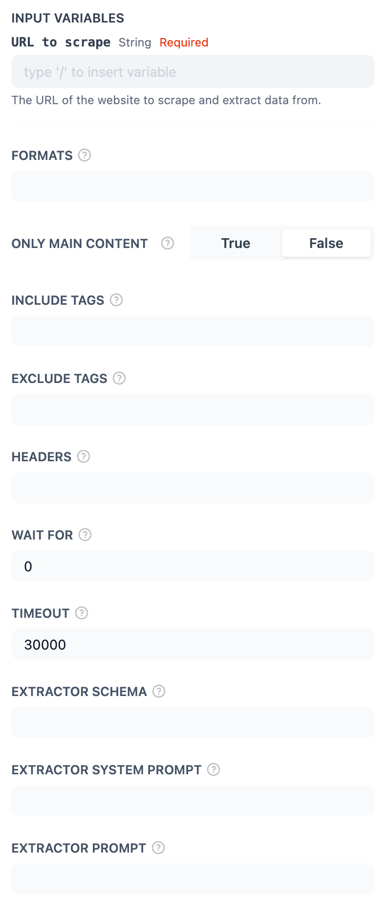
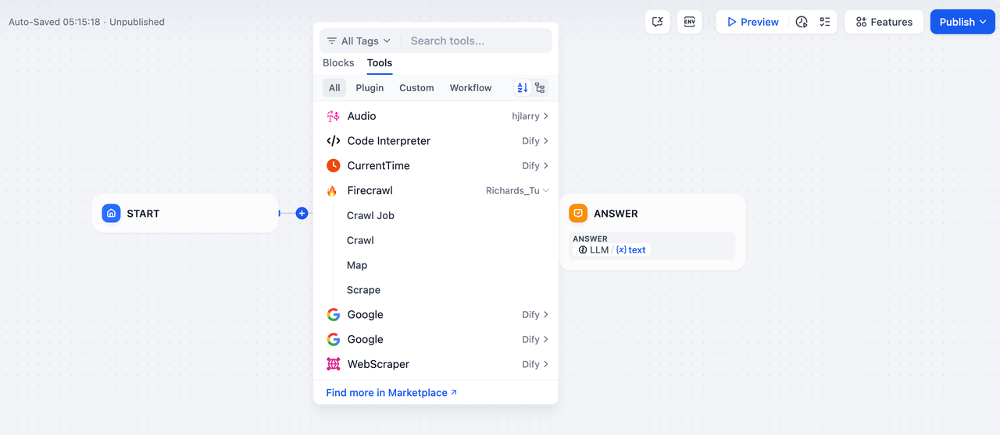
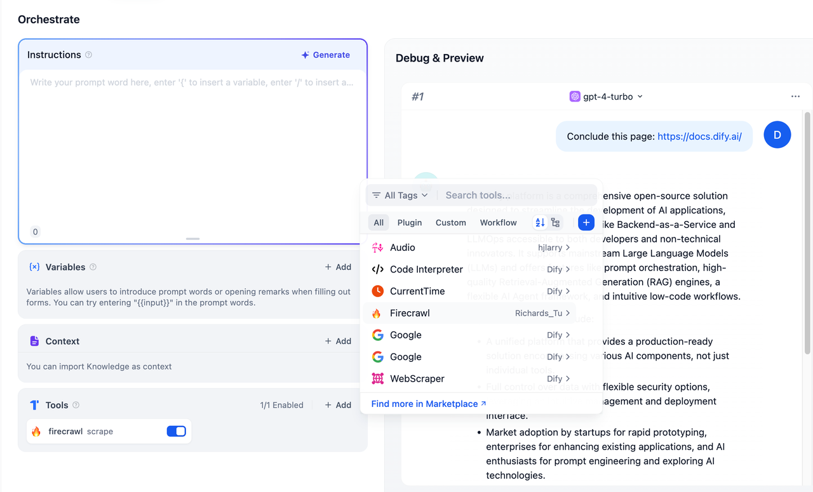

## Overview

**Firecrawl** is a powerful API integration for web crawling and data scraping. It allows users to extract URLs, scrape website content, and retrieve structured data from web pages. With its modular tools, Firecrawl simplifies the process of gathering web data efficiently. You can now use it in your application workflows for automated web data extraction and analysis.

## Configuration

To set up Firecrawl, follow these steps:

1. **Install Firecrawl Tool**
Access the Plugin Marketplace, locate the Firecrawl tool, and install it.

2. **Apply for a Firecrawl API Key**
Go to the [Firecrawl API Keys](https://www.firecrawl.dev/app/api-keys) page, create a new API Key, and ensure your account has sufficient balance.

3. **Authorize Firecrawl**
Navigate to **Plugins > Firecrawl > To Authorize** in Dify, and input your API Key to enable the tool.

## Tool Features

The Firecrawl tool provides four actions for web crawling and scraping:

### Crawl Job

Retrieve scraping results based on a Job ID or cancel an ongoing scraping task. This is ideal for managing and monitoring your workflows.

### Crawl

Perform a recursive crawl of a website's subdomains to gather content. Perfect for extracting extensive datasets from interconnected pages.

### Map

When using the **Map** action to generate a complete map of all URLs present on a site, you need to configure the following input parameters.

### Scrape

Convert any URL into clean, structured data, transforming raw HTML into actionable insights.

## Usage

Firecrawl can be seamlessly integrated into both **Chatflow / Workflow Apps** and **Agent Apps**.

### Chatflow / Workflow Apps

Integrate Firecrawl into your pipeline by following these steps:

1. Add the Firecrawl node to the Chatflow or Workflow pipeline.
2. Please select one of Firecrawl's actions (e.g., Map, Crawl, Scrape) and insert it into the pipeline.
3. Define the input variables and UI elements for your use case.
4. Execute the pipeline to trigger the Firecrawl nodes sequentially and crawl web page data.

### Agent Apps

Add the Firecrawl tool in the Agent application, then send the URL. The tool will help to scrape the online content, so the LLM will have the ability to get the latest online data.

1. Add the Firecrawl tool to the Agent application.
2. Input a URL in the chat, and Firecrawl will scrape the content from the specified webpage.
3. The extracted data is processed and made accessible to the LLM, enabling the app to fetch and analyze the latest online information.

