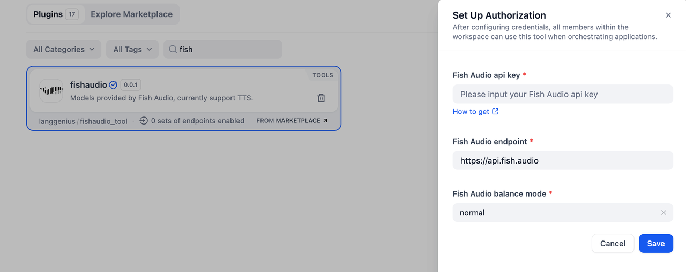
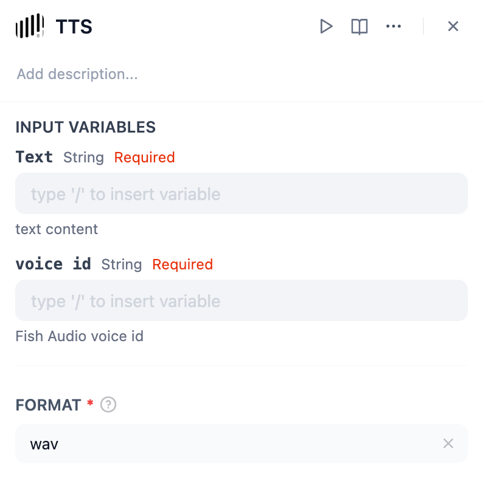
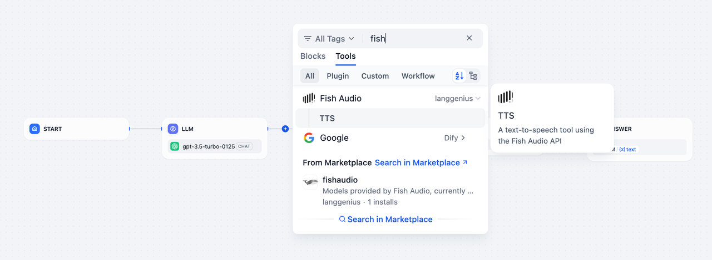
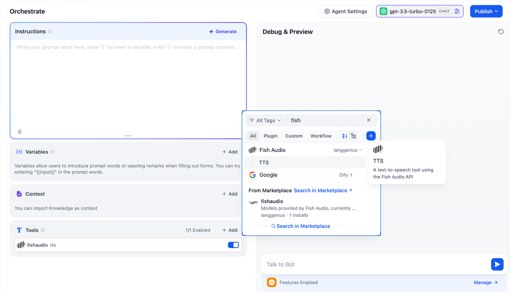

## Overview

**Fish Audio** is an advanced text-to-speech (TTS) tool powered by the Fish Audio API. It enables you to convert text into high-quality speech, offering customizable voice options for various use cases. Whether building virtual assistants, creating audiobooks, or generating voiceovers, Fish Audio provides reliable and efficient TTS functionality to enhance your applications.

## Configuration

To get started with Fish Audio, follow these steps:

1. **Install Fish Audio Tool**
Go to the Plugin Marketplace and install the Fish Audio tool to integrate its TTS functionality into your applications.

2. **Apply for Fish Audio API Key**
Visit the [Fish Audio API Keys](https://fish.audio/zh-CN/go-api/api-keys) page to generate an API Key. Make sure your account has the necessary permissions to access the TTS service.

3. **Authorize Fish Audio**
Navigate to **Tools > Fish Audio > To Authorize** your application and enter the API Key to activate the tool.

## Tool Features

The Fish Audio tool provides one primary action: **TTS (Text-to-Speech)**.

### TTS

Converts text into speech using the Fish Audio API. To use the TTS action, you need to provide the following parameters:

* **Text**: The text content you want to convert into speech.
* **Voice ID**: The unique voice identifier to be used for generating speech. Fish Audio supports multiple voice options, allowing for customization.

## Usage

Fish Audio can seamlessly integrate **Chatflow / Workflow Apps** and **Agent Apps**.

### Chatflow / Workflow Apps

1. Add the Fish Audio TTS node to your Chatflow or Workflow pipeline.
2. Configure the node by providing the text content and selecting the Voice ID.
3. When the pipeline runs, the TTS action generates speech audio, which can be played or used as part of the workflow output.

### Agent Apps

1. Add the Fish Audio TTS tool to your Agent application.
2. During interactions, send the text content through the chat interface.
3. The TTS tool will convert the text into speech and return the generated audio to the user.

