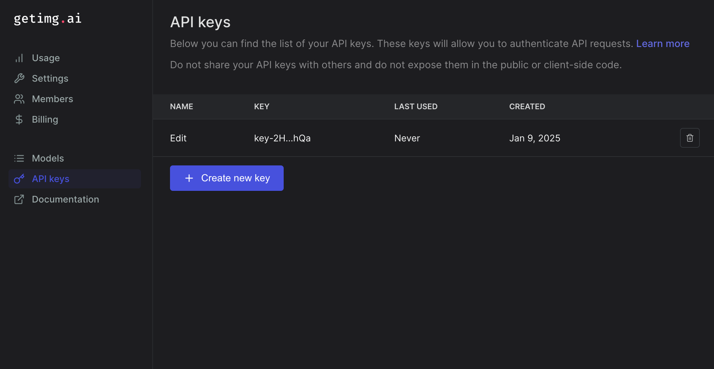
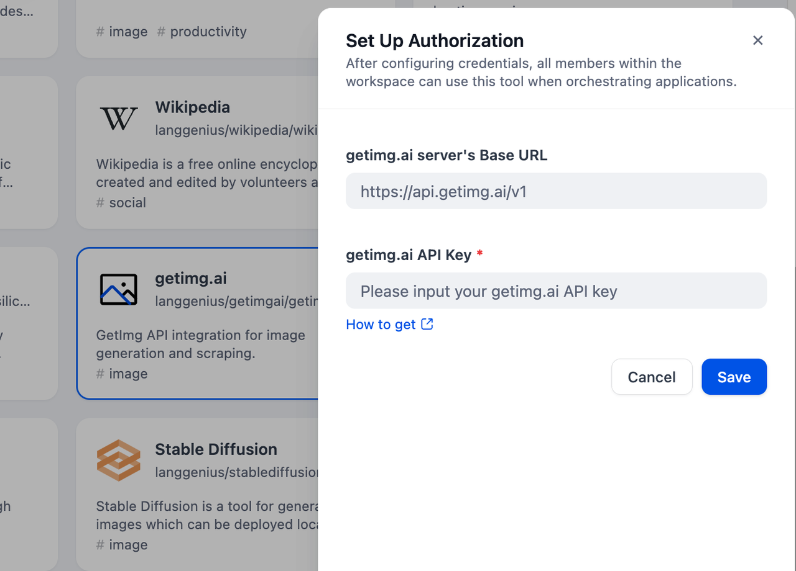

# GetImg.ai Tool

## Overview

GetImg.ai is an AI-powered platform specializing in image generation. It provides an accessible and versatile image generation solution: as a tool in Dify, it receives text inputs and generates corresponding images based on user prompts. The service offers various image styles and customization options. 

## Configuration

### 1. Apply for getimg.ai Account
Please apply for an API Key from [getimg.ai dashboard](https://dashboard.getimg.ai/api-keys).

### 2. Get getimg.ai tools from Plugin Marketplace

The getimg.ai tools could be found at the Plugin Marketplace, please install it first.

### 3. Fill in the configuration in Dify

On the Dify navigation page, click `Tools > getimg.ai > Authorize` and fill in the API Key.

### 4. Use the tool
You can use the getimg.ai tool in the following application types.

#### Chatflow / Workflow applications
Both Chatflow and Workflow applications support adding a getimg.ai tool node.

#### Agent applications
Add the getimg.ai tool in the Agent application, then enter online search instructions to call this tool.