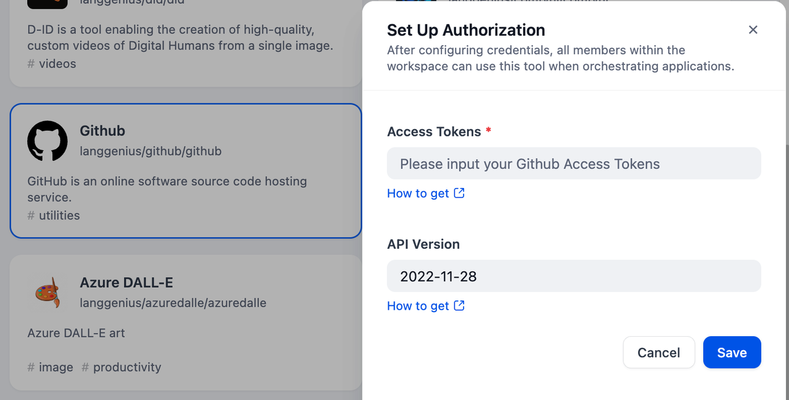
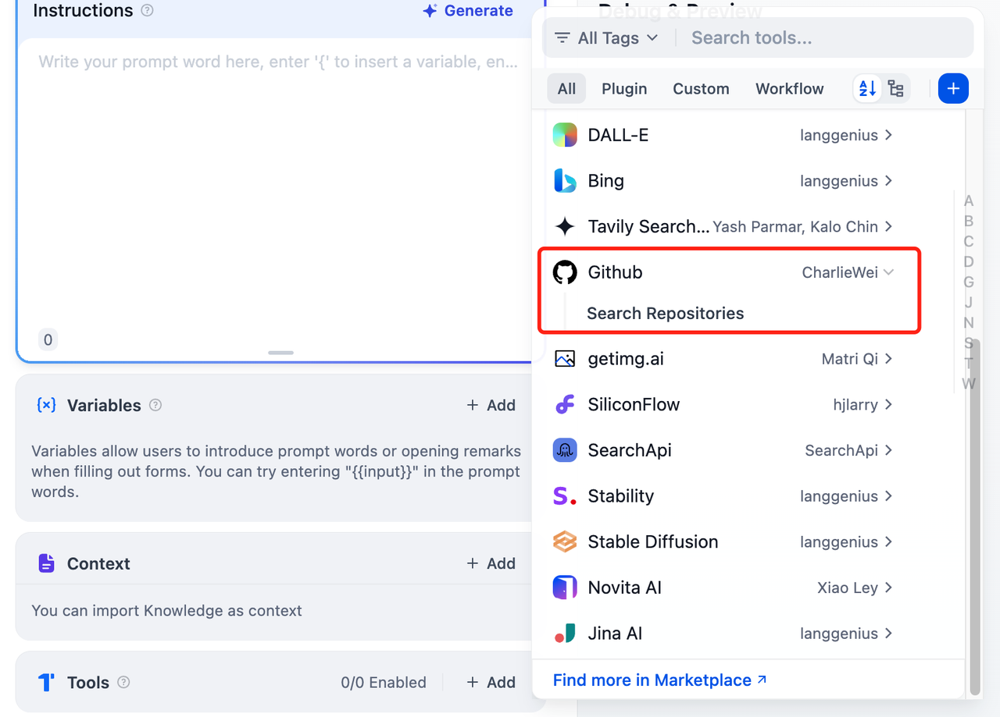

# GitHub

## Overview

GitHub is a web-based platform for version control and collaboration, primarily used for software development. As a tool in Dify, it provides users the ability to search repositories by keywords.

## Configuration

### 1. Apply for API Key and Version

Please apply for an [API Key](https://github.com/settings/personal-access-tokens) and the [API version](https://docs.github.com/en/rest/about-the-rest-api/api-versions?apiVersion=2022-11-28).

### 2. Get GitHub tools from Plugin Marketplace

The GitHub tools can be found in the Plugin Marketplace. Please install it first.

### 3. Fill in the configuration in Dify

On the Dify navigation page, click `Tools > GitHub > Authorize` and fill in the API Key.

### 4. Using the tool

You can use the GitHub tool in the following application types:

#### Chatflow / Workflow applications

Both Chatflow and Workflow applications support adding a GitHub tool node.

#### Agent applications

Add the GitHub tool in the Agent application, then enter repository search instructions to call this tool.

