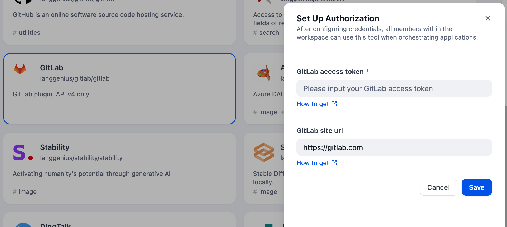
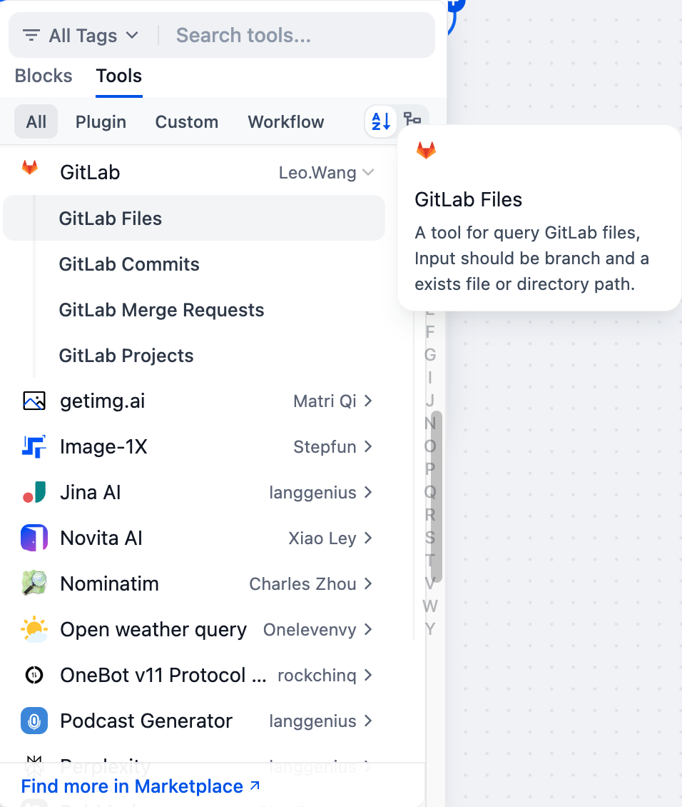

# GitLab Tool

## Overview

GitLab is a web-based DevOps platform providing tools for software development, with core functionalities including query commits, file uploads, merge requests, and project creation and management. It enables version control, code collaboration, and CI/CD (Continuous Integration/Continuous Deployment) workflows.

## Configuration

### 1. Apply for GitLab Access Token
Please follow the [offical documents](https://archives.docs.gitlab.com/16.9/ee/api/oauth2.html) to get the access token.

### 2. Get GitLab tools from Plugin Marketplace
The GitLab tools could be found at the Plugin Marketplace, please install it.

### 3. Fill in the configuration in Dify
On the Dify navigation page, click `Tools > GitLab > To Authorize` and fill in the access token.

### 4. Use the tool
You can use the GitLab tool in the following application types.

#### Chatflow / Workflow applications
Both Chatflow and Workflow applications support adding a GitLab tool node for data processing tasks.

#### Agent applications
Add the GitLab tool in the Agent application, then enter data processing commands to call this tool.