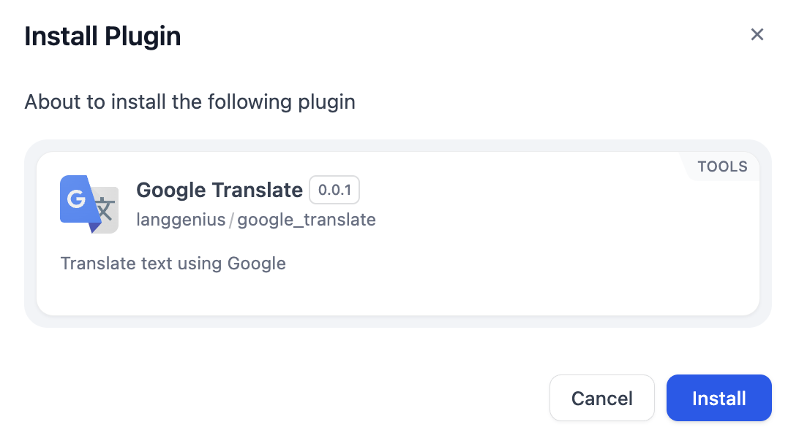
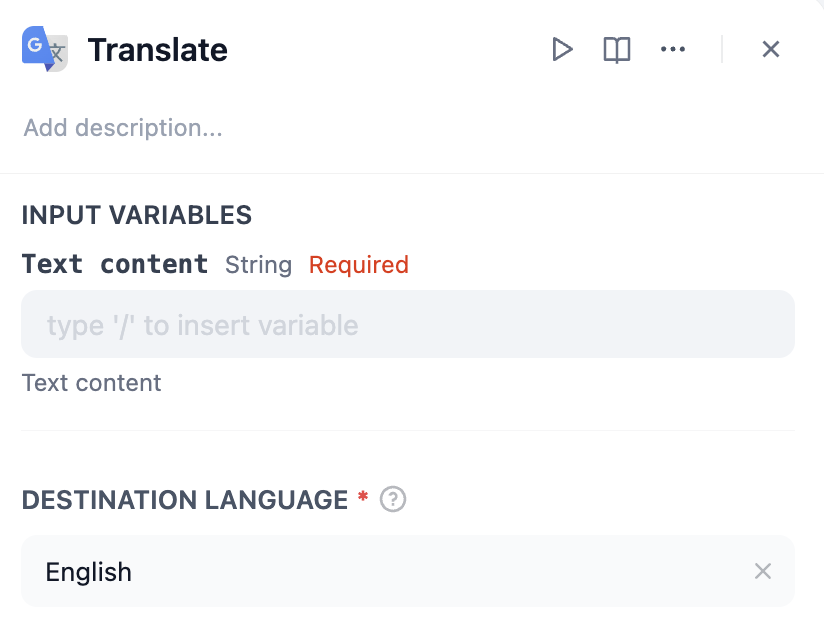
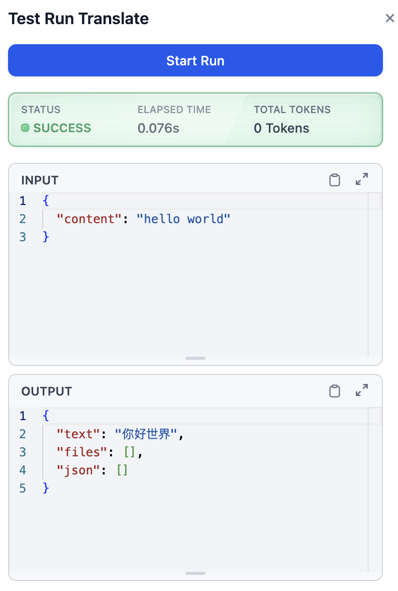

# Overview
The Google Translate Tool allows users to translate text from one language to another seamlessly. It leverages Google's robust translation capabilities to provide accurate and efficient translations. This tool is designed for developers and teams who need to integrate translation functionality into their workflows or applications.

# Configure
1. Install Google Translate from Dify Marketplace.

2. Add Google Translate to your workflow.
3. Fill in variables.

  - **Text Content** (Required): This is the string input that needs to be translated. You can type or insert the variable directly into the provided field.
  - **Destination Language**: This is a required field where you specify the target language for translation (e.g., "English," "Spanish," "French"). Ensure the name of the language matches Google's supported languages.
