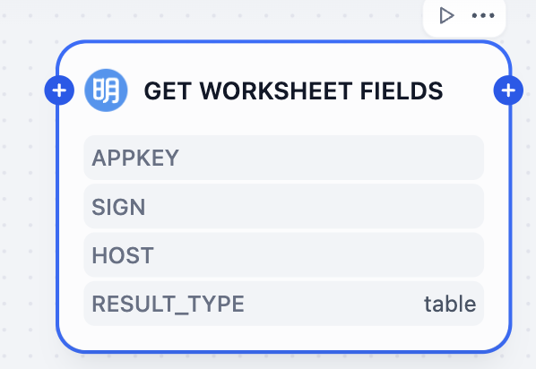
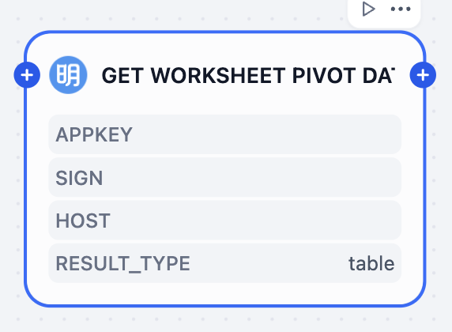
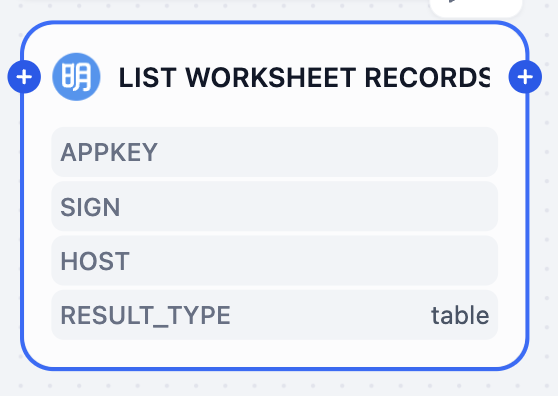
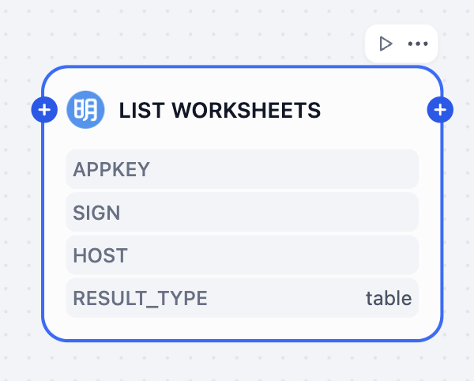
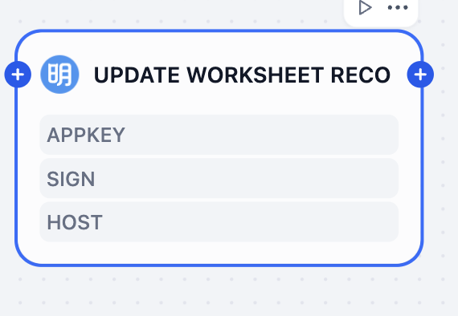

# Overview
HAP (Hyper Application Platform), developed by 明道云 (Mingdao Cloud), is an APaaS (Application Platform as a Service) solution designed to enable enterprises to build, automate, and integrate applications with minimal or no coding. It empowers businesses to streamline operations, bridge data silos, and enhance collaboration through its robust no-code and low-code capabilities.
You can operate worksheets in HAP using the HAP tool.

# Configure
## Installation
1. Install HAP from Dify Marketplace.

2. Add HAP to your workflow.

## Tools
### Add Worksheet Record

### Get Worksheet Fields

### Delete Worksheet Record

### Get Worksheet Pivot Data

### List Worksheet Records

### List Worksheets

Update Worksheet Record

For further help, please refer to the [HAP documentation](https://help.mingdao.com/worksheet/introduction/).