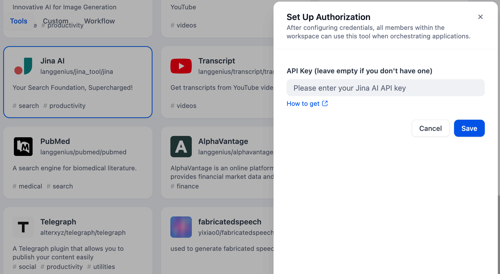
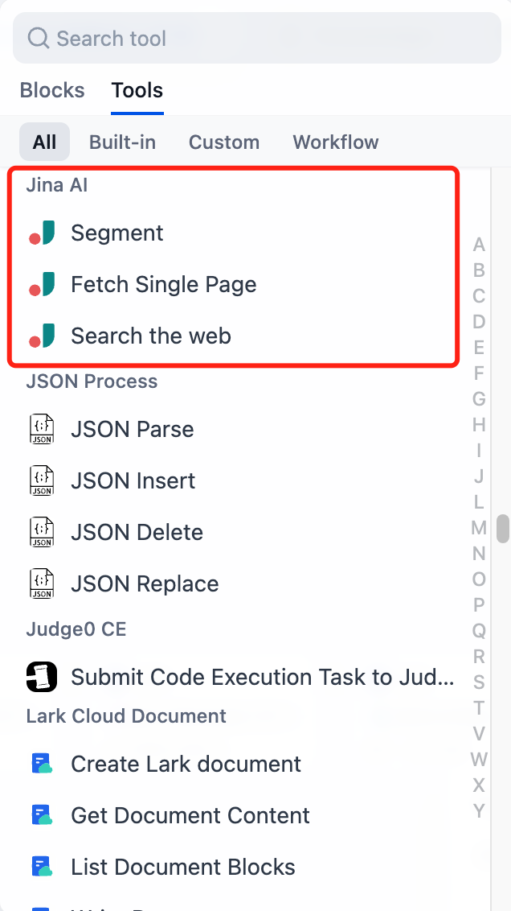

# Jina AI

## Overview

Jina AI is an open-source neural search framework for building scalable, multimodal AI applications. It provides tools for indexing and retrieving diverse data, including the ability to segment webpages, fetch single pages, and search websites. It focuses on simplifying complex AI search functionalities, and making web data processing easier.

## Configuration

### 1. Apply for Jina API Key

Please apply for an API Key on the [Jina homepage](https://jina.ai/).

### 2. Get Jina AI tools from Plugin Marketplace

The Jina tools could be found at the Plugin Marketplace, please install it first.

### 3. Fill in the configuration in Dify

On the Dify navigation page, click `Tools > Jina AI > To Authorize` and filling the API Key.

### 4. Use the tool

You can use the Jina tool in the following application types:

#### Chatflow / Workflow applications

Both Chatflow and Workflow applications support adding `Jina` tool nodes.

#### Agent applications

Add the Jina tool in the Agent application, then enter the online search command to call this tool.