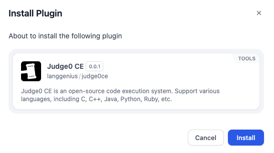

# Overview
[Judge0 CE](https://ce.judge0.com/) is a robust online code execution and compilation platform. This plugin allows users to compile and run code in multiple programming languages directly within workflows, making it ideal for automating tasks such as code evaluation, testing, or educational exercises. 

By leveraging Judge0 CE, you can execute code snippets securely and efficiently in a sandboxed environment.

# Configure

## 1. Install the Plugin
1. Go to the **Dify Marketplace**.
2. Search for the **Judge0 CE Plugin**.
3. Click "Install" to add the plugin to your workspace.

## 2. Obtain API Key
1. Visit [RapidAPI](https://rapidapi.com/judge0-official/api/judge0-ce).
2. Sign up or log in to your RapidAPI account.
3. Subscribe to the Judge0 CE API and generate your API Key from the RapidAPI dashboard.

## 3. Authorize the Plugin
1. Add any of the Judge0 CE tools (e.g., "Code Execution") to your workflow in Dify.
2. Click on the "To authorize" button in the tool configuration panel.
3. Enter your RapidAPI API Key in the provided field.
4. Save your credentials to complete the authorization process.