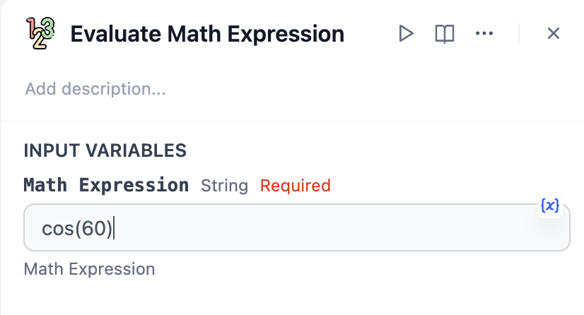

# Overview
Math Expression Evaluator online is an online tool that allows you to enter a math expression and get its value. It could evaluate math expression, like a calculator on steroid (you can use function like sqrt, cos, sin, abs, ...).

To use this math expression evaluator, you only need to enter the math expression that you want to evaluate in the input field. Then it will show you the value of the expression.

# Configure
1. Install Maths from Dify Marketplace.

2. Add Maths to your workflow.
3. Fill in the math expression. For example cos(60).

4. For further help, please refer to the readme of the tool.