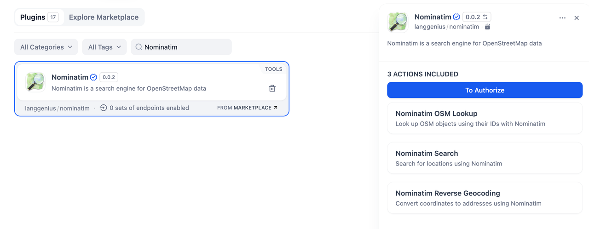
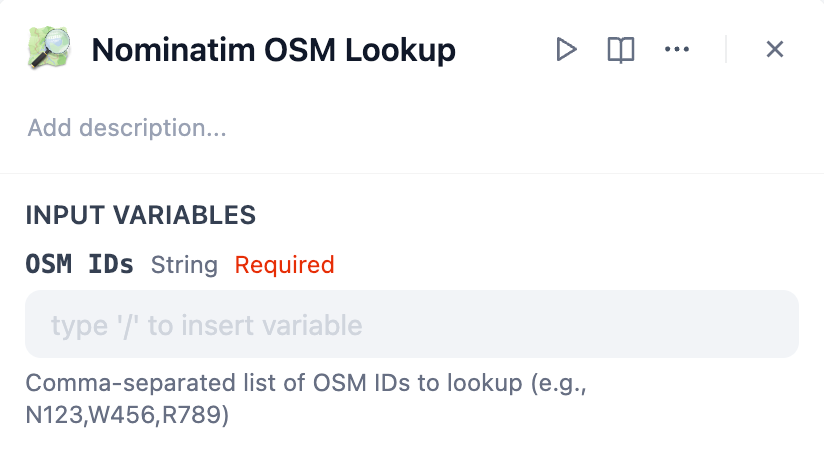
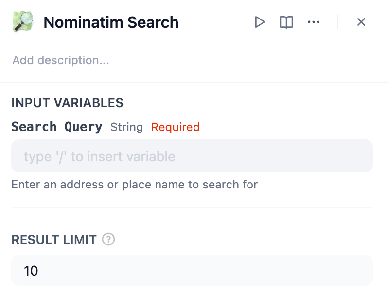
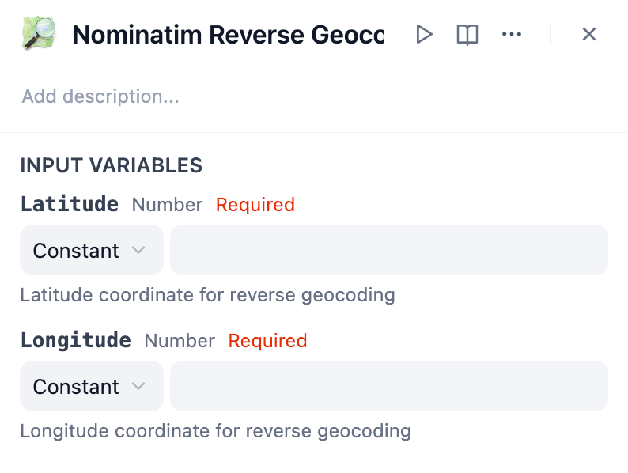
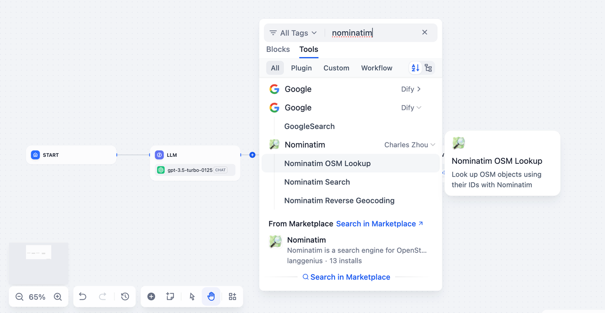
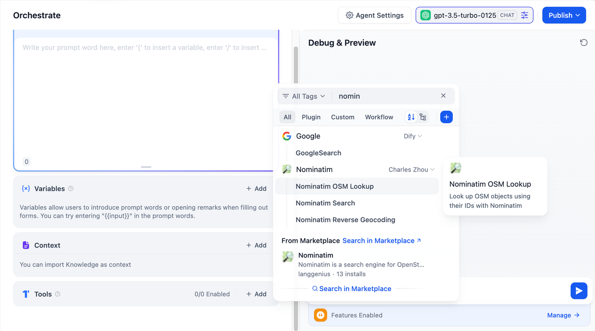

## Overview

**Nominatim** is a powerful geocoding tool for accessing and interacting with OpenStreetMap (OSM) data.

In **Dify**, Nominatim allows you to search for locations, reverse geocode coordinates, and look up OSM objects by their IDs. It streamlines the process of retrieving geographic information, making it easy to integrate location-based services into your applications.

## Configuration 

To start using **Nominatim**, follow these steps:

1. **Install the Nominatim Tool** Open the Plugin Marketplace, search for the Nominatim tool, and install it to integrate it with your application.

2. **Get a Nominatim API Key** Go to the [API Key Management](https://nominatim.org/) page of the Nominatim service, create a new API Key, and ensure your account has the required permissions to access the service.

3. **Authorize the Nominatim Tool** In Dify, go to **Plugins > Nominatim > Authorize**. Enter your API Key to activate the tool.

## Tool Features

The **Nominatim** plugin provides three primary actions to interact with OSM data:

### 1. Nominatim OSM Lookup

This feature allows you to retrieve information about specific OSM objects using their unique IDs.

* **Input:** A comma-separated list of OSM IDs (e.g., `N123, W456, R789`).

### 2. Nominatim Search

Perform forward geocoding by searching for addresses or place names.

* **Input:** Enter an address or place name in the "Search Query" field.
* **Optional:** Set the "Result Limit" to control the maximum number of search results (default: 10).

### 3. Nominatim Reverse Geocoding

Convert geographic coordinates (latitude and longitude) into a human-readable address.

* **Input:** Provide latitude and longitude values.

## Usage

**Nominatim** can be integrated into both Chatflow / Workflow Apps and Agent Apps for a variety of use cases.

### Chatflow / Workflow Apps

1. Add the Nominatim node to your Chatflow or Workflow pipeline.
2. Configure the input variables for the action you want to perform (e.g., OSM Lookup, Search, Reverse Geocoding).
3. Run the pipeline to process geographic queries and deliver results as part of the workflow.

### Agent Apps

1. Add the Nominatim tool to your Agent application.
2. Send a query via the chat interface (e.g., enter coordinates for reverse geocoding or search for a place).
3. The tool processes the query and returns the corresponding data.

## Use Cases

* **Location Search:** Find geographic details for specific addresses or place names.
* **Reverse Geocoding:** Convert GPS coordinates into readable addresses for mapping or reporting.
* **OSM Object Lookup:** Retrieve detailed data for OSM objects using their unique identifiers.
* **Geographic Analysis:** Analyze and visualize geographic data for applications like logistics or urban planning.

With **Nominatim**, you can streamline your access to OpenStreetMap data and build powerful location-based applications with ease.
