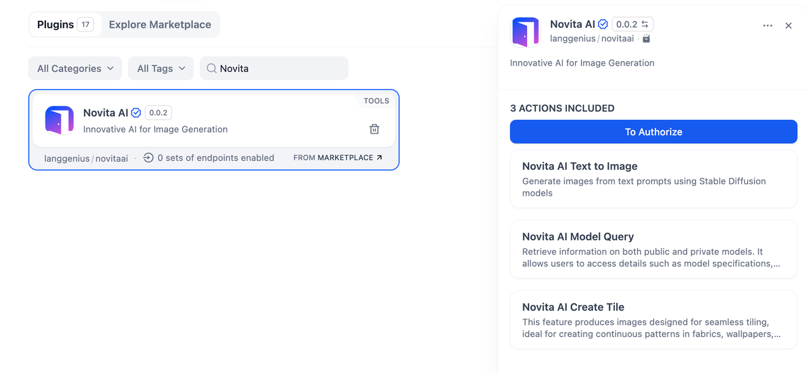
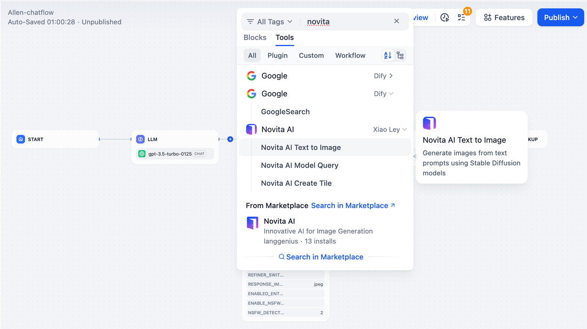
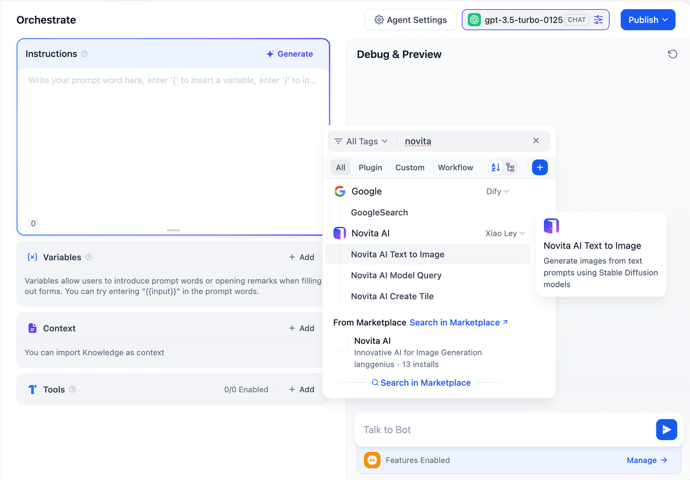

## Overview

**Novita AI** is an innovative tool for image generation and model exploration.

In **Dify**, Novita AI allows you to create stunning visuals, explore model details, and generate seamless tile patterns for various design needs. With advanced AI capabilities, Novita AI simplifies creative processes and enhances workflows.

## Configuration

To start using **Novita AI**, follow these steps:

1. **Install the Novita AI Tool** Browser the Plugin Marketplace, search for the Novita AI tool, and install it to integrate it with your application.

2. **Get a Novita AI API Key** Go the Novita AI API page, create a new API Key, and ensure your account has the necessary permissions to access its features.

3. **Authorize Novita AI** In Dify, go to **Plugins > Novita AI > Authorize**. Enter your API Key to activate the tool.

## Tool Features

The **Novita AI** plugin provides three main actions to power your creative projects:

### 1. Novita AI Text to Image

Generate high-quality images from text prompts using Stable Diffusion models.

* **Input:** Provide a descriptive text prompt to create your desired image.
* **Output:** A visually stunning image based on your input.

### 2. Novita AI Model Query

Retrieve detailed information about public and private models.

* **Input:** Specify the model you want to query.
* **Output:** Information such as model specifications, capabilities, and availability.

### 3. Novita AI Create Tile

Create seamless tile patterns for design purposes.

* **Input:** Define the specifications or pattern requirements.
* **Output:** A tiled image suitable for fabrics, wallpapers, or backgrounds.

## Usage

Novita AI can seamlessly integrate Chatflow / Workflow Apps and Agent Apps.

### Chatflow / Workflow Apps

1. Add the Novita AI node to your Chatflow or Workflow pipeline.
2. Select one of the actions (e.g., Text to Image, Model Query, or Create Tile) and configure the inputs.
3. Run the pipeline to generate images, retrieve model details, or produce seamless tiles for your use case.

### Agent Apps

1. Add the Novita AI tool to your Agent application.
2. Send a text prompt, model query, or tile specification via the chat interface.
3. The tool processes your input and returns the desired output (e.g., image, model details, or pattern).

## Use Cases

* **Image Generation:** Quickly create visuals for marketing, storytelling, or social media content.
* **Model Exploration:** Access detailed information about AI models for research or development purposes.
* **Seamless Patterns:** Design tiled images for fabrics, wallpapers, or user interface backgrounds.
* **Creative Automation:** Streamline repetitive design tasks with AI-powered image generation.

With **Novita AI**, you can unlock new possibilities for creative expression and create a more efficient AI app.
