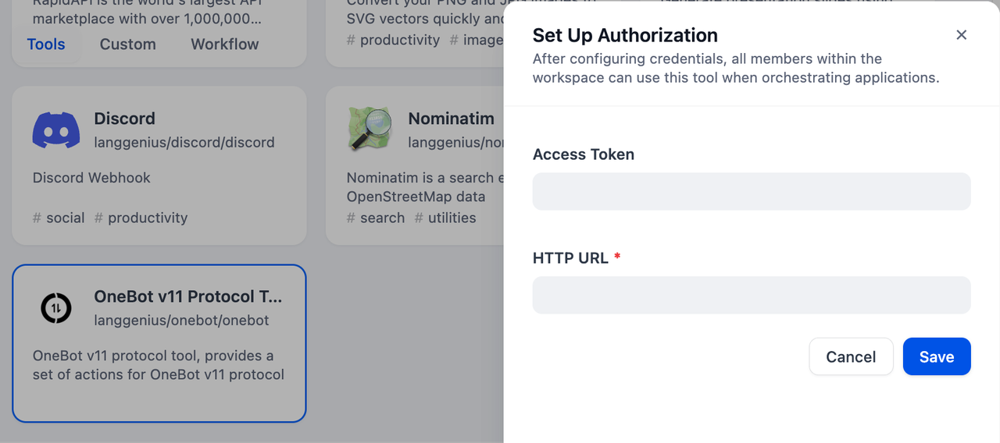
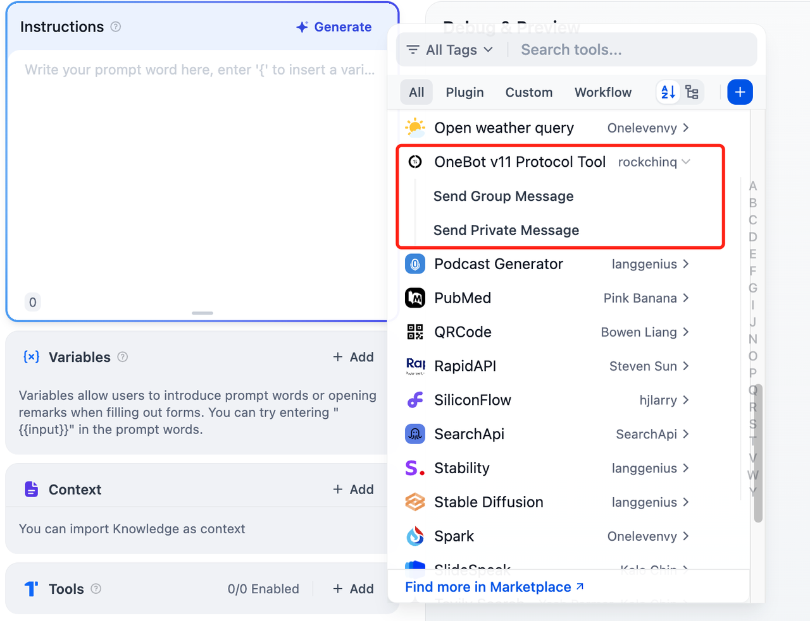

# OneBot v11 Protocol Tool

## Overview

This is a tool built for interacting with the OneBot v11 protocol. It enables developers to create and manage bots that communicate with various messaging platforms. Functionalities include sending and receiving messages, handling events, managing group and user information, and more. It provides a framework for building versatile and automated chat applications. The tool offers extensive API access for interacting with the protocol.

## Configuration

### 1. Apply the Access Token and HTTP URL from the [github link](https://11.onebot.dev/).

### 2. Get OneBot v11 Protocol tools from Plugin Marketplace
   The OneBot v11 Protocol tools could be found at the Plugin Marketplace, please install it first.

### 3. Fill in the configuration in Dify

On the Dify navigation page, click `Tools > OneBot v11 Protocol Tools > To Authorize` and fill in the Access Token and HTTP URL.

   

### 4. Use the tool

You can use the OneBot v11 Protocol tool in the following application types:

   

#### Chatflow / Workflow applications

    Both Chatflow and Workflow applications support the OneBot v11 Protocol tool node.
   
#### Agent applications

    Add the OneBot v11 Protocol tool in the Agent application, then enter the private message or public message to call this tool.