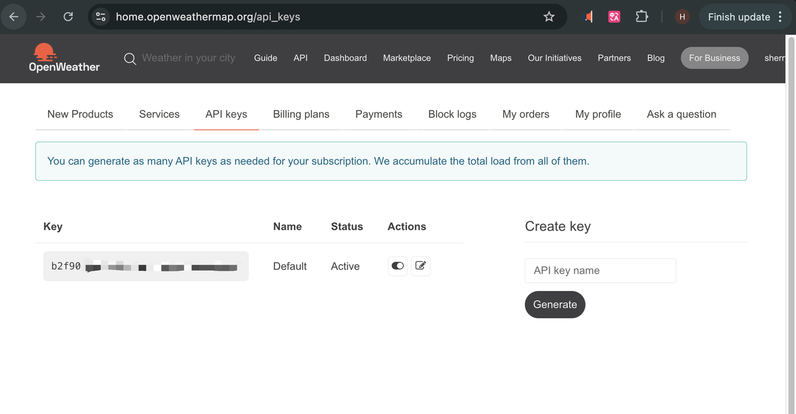
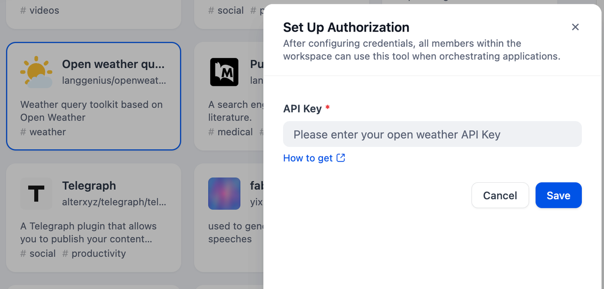
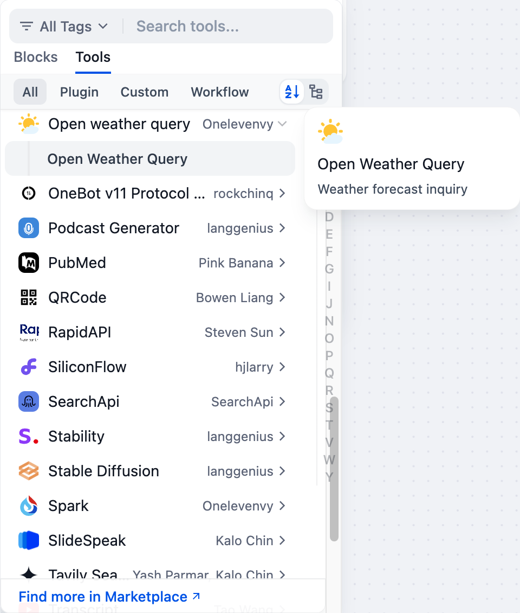
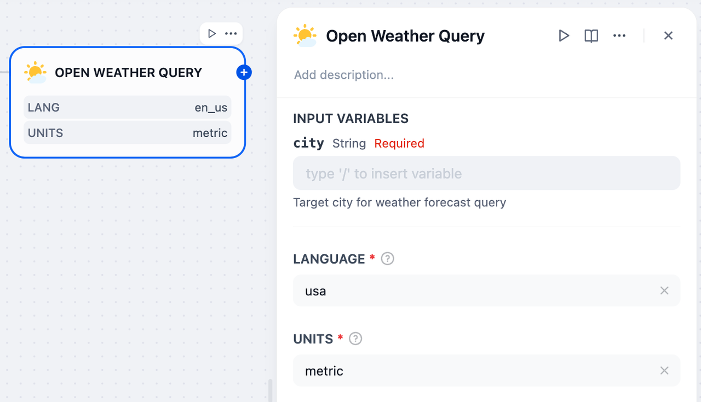

# Open Weather query

## Overview

OpenWeather provides an API service offering access to global weather data. It allows developers to retrieve current conditions, forecasts, historical data, and other weather-related information. It supports various data formats and query parameters for different use cases.

## Configuration

### 1. Apply for Open Weather API Key
Please apply for an API Key on [Open Weather](https://home.openweathermap.org/api_keys).

### 2. Get Open Weather query tools from Plugin Marketplace
The Open Weather query tools could be found at the Plugin Marketplace, please install it.

### 3. Use the tool
You can use the Open Weather query tool in the following application types.

#### Chatflow / Workflow applications
Both Chatflow and Workflow applications support adding an `Open Weather query` tool node.

#### Agent applications
Add the `Open Weather query` tool in the Agent application, then enter the city name to call this tool.
