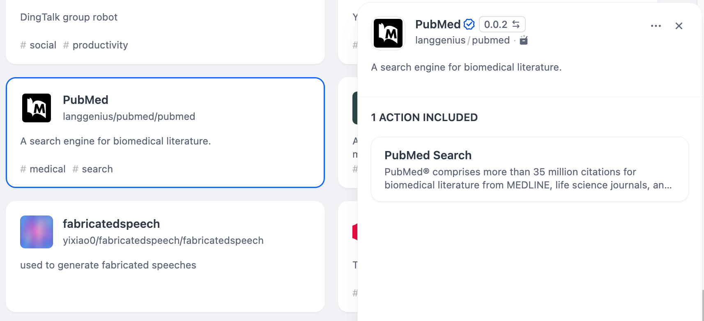
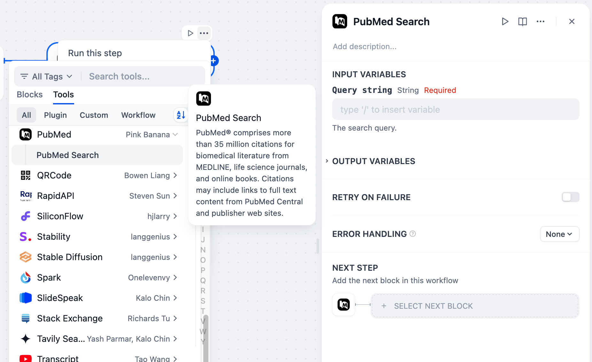

# PubMed

## Overview

PubMed is a search engine providing access to biomedical literature and research. It indexes citations and abstracts from MEDLINE, life science journals, and online books. It offers features such as keyword searching, advanced filters, and citation tracking.

## Configuration

### 1. Get PubMed tools from Plugin Marketplace

The PubMed tools could be found at the Plugin Marketplace, please install it.

### 2. You can use the PubMed tool in the following application types.

#### Chatflow / Workflow applications

Both Chatflow and Workflow applications support the PubMed tool node.

#### Agent applications

Add the PubMed tool in the Agent application, then enter the search query to call this tool.