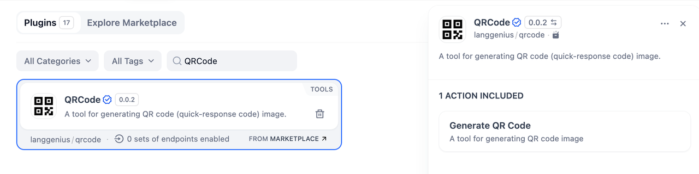
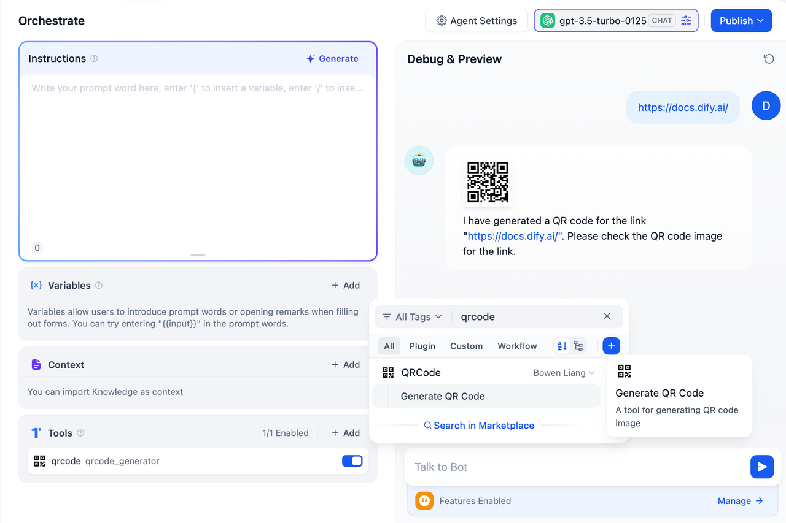

## Overview

**QRCode** is a simple yet effective tool for generating QR code images.

In **Dify**, QRCode allows you to quickly create QR codes for various types of content, such as URLs, text, or other information. This tool is ideal for sharing data visually and efficiently.

## Configuration

Open the Plugin Marketplace, search for the QRCode tool, and install it to integrate it with your application.

## Tool Features

The **QRCode** plugin includes a single, highly customizable action:

### Generate QR Code

Generate a QR code image based on your specified content and configuration.

**Input Variables:**

* **Content Text for QR Code (Required):** Enter the text or data to encode in the QR code.
* **Error Correction (Required):** Choose the error correction level (e.g., Low, Medium, Quartile, High) to ensure QR code readability even with partial damage.
* **Border Size (Required):** Define the size of the border around the QR code (default: 2).
* **Output:** A generated QR code image that encodes the specified content and adheres to the selected error correction level and border size.

This action provides flexibility for generating QR codes tailored to your specific needs, ensuring reliable encoding and clear presentation.

## Usage

QRCode can seamlessly integrate Chatflow / Workflow Apps and Agent Apps.

### Chatflow / Workflow Apps

1. Add the QRCode node to your Chatflow or Workflow pipeline.
2. Configure the "Generate QR Code" action by specifying the content text for the QR code.
3. Run the pipeline to generate the QR code and deliver it as part of your workflow.

### Agent Apps

1. Add the QRCode tool to your Agent application.
2. Send the text or data you want to encode via the chatbox.
3. The tool processes your input and returns the generated QR code image.

## Use Cases

* **Link Sharing:** Create QR codes for URLs to simplify link sharing.
* **Event Promotions:** Generate QR codes for event invitations or ticketing.
* **Business Cards:** Add QR codes to business cards for quick contact sharing.
* **Content Access:** Access digital content such as documents, images, or videos.

With **QRCode**, you can quickly create visually shareable data representations, making connecting and sharing information easy.
